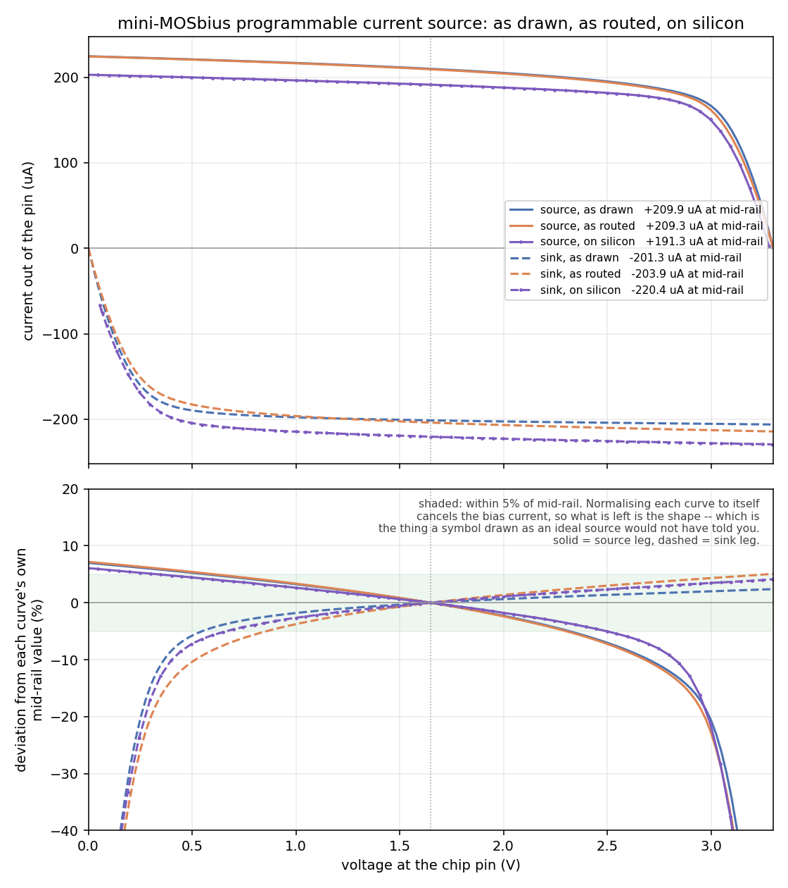

# Programmable current source and sink

Two devices and one property each: `XI1` sources current out of `ua2` down
from the supply, `XI2` sinks current into `ua3` down to ground. Both are
slaves of the chip's own bias reference, and `ratio` -- 1 to 4, in
multiples of the reference current -- is the only property either has.
Neither has a drawn bias pin: `ibias` reaches them implicitly, the same
way the body ties do, so the sheet has two wires on it. This is the only
example whose subject is the bias current itself, and the only one that
measures a current rather than a voltage.



*Fig. 1. Current out of each pin against the voltage on that pin, and the
same curves normalised to their own mid-rail value: as drawn (ideal
wires), as routed (through the configured switch matrix, from `mosbius
simulate`), and measured on a ttsky25a chip with an Analog Discovery 3,
both legs at `ratio=2` and about 100 uA of bias.*

| at mid-rail | as drawn | as routed | on silicon |
|---|---|---|---|
| `psource_a` (source) | +209.9 uA | +209.3 uA | +191.3 uA |
| `nsink_a` (sink) | -201.3 uA | -203.9 uA | -220.4 uA |
| output resistance, 0.5-2.3 V (source) | -- | 85.5 kOhm | 120 kOhm |
| output resistance, 0.5-2.3 V (sink) | -- | 79.1 kOhm | 107 kOhm |

*The normalised panel is the honest comparison: it cancels the bias
current, which on a demoboard without a programmable source is a bench
supply through a resistor and is the least trustworthy number in the
measurement.*

## Try this

Check that `ratio` means what the bit map says it means. Everything above
was taken at `ratio=2`, and `ratio` and the bias current enter the answer
only as a product, so nothing here separates them. Route the same sheet at
`ratio` 1, 2, 3 and 4 -- four bitstreams -- and measure one leg at each.
The ratio of two currents from the same reference cancels the bias source
entirely, so this is the one measurement on this example that an
uncalibrated bias cannot spoil.

## Reproducing the numbers

```bash
sh tools/ci/check_example_sim.sh currentsource                 # as drawn and as routed, in the container
python3 tools/ad3/measure_ibias_clamp_ad3.py --resistor 20000   # set the bias rail
python3 tools/ad3/measure_currentsource_ad3.py                  # on silicon, on the host
python3 tools/plot_currentsource_comparison.py              # the figure
```
