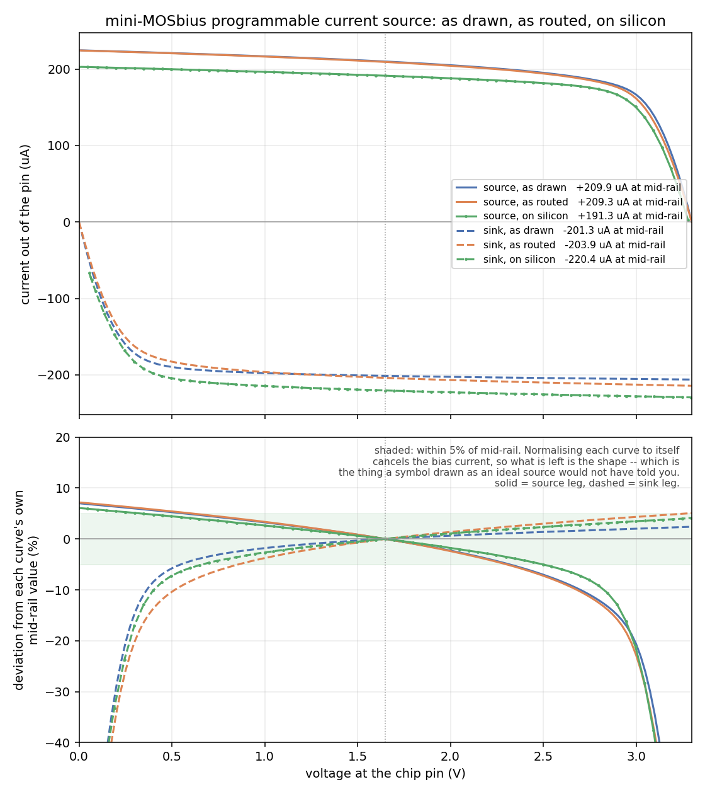

# Example: programmable current source and sink

*Shared background for all six examples -- as drawn vs as routed, the
testbench idiom, the bias reference, the common gotchas -- is in
[`../README.md`](../README.md).*

The only example whose subject is `ibias` itself rather than the bias
being a detail of something else, and the only one that measures a
current rather than a voltage. Getting it right took a correction to the
ideal device library that this example is what found -- see "The bug this
example found" below.

Two devices, one property each:

```
XI1 ua2 ibias VAPWR mosbius_psource ratio=2
XI2 ua3 ibias VGND  mosbius_nsink   ratio=2
```

`I1` sources current out of `ua2`, down from `VAPWR`; `I2` sinks current
into `ua3`, down to `VGND`. Neither has a drawn bias pin -- `ibias` is
supplied implicitly by the symbol, the same way the body ties are -- so
the sheet has exactly two wires on it. `ratio` is the only property either
symbol has: 1 to 4, in multiples of the chip's reference current.

It is the only example that uses `mosbius_psource` or `mosbius_nsink`.

## Routing

```
$ python3 -m mosbius.cli route build/currentsource.spice
OK -- no errors or warnings (1 info note hidden, use --verbose).

Device roles:
  XI1          -> psource_a     ratio=2
  XI2          -> nsink_a       ratio=2

Bus rows:
  ua2      bus_A[3]   package pin ua2 -- bond pad + analog mux
  ua3      bus_A[5]   package pin ua3 -- bond pad + analog mux

Bitstream: 000400400000000000010000000000008000000000000000
```

Both outputs have to be on package pins: a current you cannot connect an
ammeter to is a current you cannot measure. Neither leg is a diff-pair
input, so neither is restricted to bus rows 1-3.

## The testbench measures current, not voltage

`tb_currentsource.sch` departs from the other testbenches in three ways,
each for a reason.

**One swept voltage source, four ammeters.** `Vsweep` holds a single node
at a voltage the `dc` analysis sweeps from 0 to 3.3V, and each of the four
legs (source and sink, drawn and routed) reaches that node through its own
0V voltage source acting as an ammeter. Every leg therefore sees exactly
the same output voltage -- the same controlled-variable logic the load
capacitors use elsewhere -- while its current is read separately as
`i(vam_...)`. The sign convention follows from the wiring: positive means
current leaving the chip pin, so the source leg reads positive and the
sink leg negative.

**A `dc` sweep, not a transient.** This is the first deck here that is not
`tran`. What the example is about is an I-V curve: how much current comes
out, and how close to the rail it holds before the mirror leaves
saturation.

**No load capacitors.** They model a scope probe, and at DC there is
nothing for a probe capacitance to do. The reason they exist elsewhere
(see `../README.md`) does not apply here.

**Two bias sources, one per instance.** `Ibias_drawn` and `Ibias_routed`
are separate current sources, both `'ibias_amps'` with
`.param ibias_amps=100u`. Every testbench here does that now, and this
example is why it changed: two chips in parallel on one reference current
get roughly half each, and the split depends on the two instances' input
impedances, so the operating point of *both* branches moves. Held equal but separate, the
only difference between the branches stays the chip. Measured here: the
routed source leg reads 209 uA with separate sources against 482 uA
sharing one.

## What running it shows

At `Vsweep=1.65V`, `ratio=2`, `ibias_amps=100u`, measured 2026-08-28:

| leg | as drawn | as routed | expected |
|---|---|---|---|
| `psource_a` (source) | +209.9 uA | +209.3 uA | +200 uA |
| `nsink_a` (sink) | -201.3 uA | -203.9 uA | -200 uA |

Both legs deliver `ratio x ibias`, and the two branches agree within 1.3%
-- as they should, since a current mirror's output current is set by its
gate voltage, and the switch matrix's series resistance changes the
*voltage* at the pin, not the current through it. That is the same
"resistance costs speed, not accuracy" result the diff amp gives for gain,
measured on the DC quantity instead.

## The whole curve, and where it stops being a current source

That mid-rail number is one point on an I-V curve, and the sweep is the
reason to run this example rather than trust the label. The source leg
across the whole supply, as drawn:

| pin voltage | 0.0 V | 1.0 V | 1.65 V | 2.5 V | 2.9 V | 3.0 V | 3.2 V | 3.3 V |
|---|---|---|---|---|---|---|---|---|
| `psource_a` | 224.6 uA | 216.7 | 209.9 | 195.2 | 178.5 | 166.6 | 83.0 | 0.0 |

Three separate effects live in that one row, and telling them apart is
what the example is for.

**The gentle slope from 0 to 2.5 V is finite output resistance,** not a
flat region: 11.8 uA/V, about 85 kOhm. Taking the mid-rail value as
nominal, the current is within 5% only between about 0.575 V and 2.325 V
-- bounded at *both* ends, which is the part that surprises. A mirror leg
is not an ideal current source, and "200 uA" as a label hides a curve
that moves by 13% before anything has gone wrong.

**Above about 2.5 V the PMOS leaves saturation** and the slope tears
away: 57 uA/V up to 3.0 V, then 555 uA/V beyond it, reaching zero at
VAPWR where there is no drain-source voltage left to work with. That knee
is the compliance limit, and it is why the symbol is drawn as a
transistor rather than as an ideal-source circle -- the glyph would
promise behaviour the hardware does not have.

**209.9 uA rather than exactly 200 is the classic mirror error.** The
slave sits at a different drain-source voltage from the diode-connected
reference it copies, and the one with more voltage across it passes more.
The curve crosses 200 uA at about 2.3 V of pin voltage, which is
therefore where the slave's |Vsd| matches the reference's -- putting the
reference at roughly 1.0 V. That last step is inferred from where the
curves cross, not read off a probe on the bias node.

**The routed curve tracks the drawn one within 0.5% until the knee,**
then degrades slightly faster: at 3.0 V the drawn leg is down 20.6% from
its mid-rail value and the routed one 22.8%. Read as a voltage instead of
a current, the routed leg behaves like the drawn one biased 24.3 mV
lower, which at 162 uA is on the order of 150 Ohm of series resistance in
the matrix and the pad. That is arithmetic on two simulated curves rather
than a measured resistance. It is also the same lesson the other examples
give from the other side: at DC the matrix costs you nothing until you
are close to a rail, and there the tens of millivolts it eats are the
difference between working and not.

## The bug this example found

The first version of this measurement read +501 uA and -707 uA as drawn
against the routed branch's correct +209/-204 uA. Both faults were in the
ideal device library, and both are fixed as of 2026-08-28.

**Every device carried its own copy of the chip's bias reference.** Each
`mosbius_nsink`/`mosbius_psource`/`mosbius_ntail`/`mosbius_ptail` held a
diode-connected reference transistor on the shared `ibias` net as well as
its slave. Silicon has exactly one reference: pin `ua[0]` feeds
`mirror_n`'s reference leg and every programmable leg is a slave off that
one gate voltage. Replicating it meant N devices split the one reference
current N ways -- measured, two `mosbius_nsink ratio=2` gave -99 uA each
where -200 uA was right, while one alone gave the correct -201 uA.

**And `mosbius_psource` referenced the wrong node.** Its reference was a
PMOS diode from `ibias` up to `VAPWR`, but `ibias` is the NMOS-referenced
node: current is pushed *into* it and is meant to flow *down* through an
NMOS diode. A lone psource therefore delivered **1.65 pA** -- the injected
current had nowhere to go and the node floated up to the rail. Put an
nsink beside it and the two diodes formed a conducting chain across the
supply, pinning `ibias` where they balanced: that is where +501 uA and
-707 uA came from.

The fix is one bias generator per design, reproducing the chip's own
`ua[0]` -> `mirror_n` -> `ibias_p` -> `mirror_p` chain at those
schematics' device sizes (NMOS reference L=1 W=10 nf=2, a 1:1 NMOS copy,
PMOS diode L=1 W=30 nf=4). The device symbols keep only their slave legs,
and `mosbius_psource` now references `ibias_p`, which is what
`mosbius_ptail.sym`'s template had been asking for all along against a net
nothing generated.

**Where that generator lives is a symbol of its own.** This sheet places
one `mosbius_bias` from `xschem/mosbius_lib`, wired to the `ibias` pin --
which is an ordinary `devices/iopin.sym` like the other eight. Descend
into the symbol and you see the chip's three transistors drawn; on the
sheet it is one block, drawn as a current sink because that is what it is
from the pin's side. Only its `ibias` pin is drawn: `ibias_p` and the two
rails ride in on `extra`, the same way a FET's body tie does, so
`ibias_p` is an ordinary net of your design's subcircuit -- created by the
block, picked up by `mosbius_psource` through its template, never drawn.

**Exactly one per design**, and `mosbius route` enforces it (`B1`): none
leaves every mirror gate wherever the DC solver puts it, and two share the
demoboard's current between them so every `ratio=` and `tail=` comes out
at half. The check also counts the older hand-drawn form -- an NMOS with
its gate and drain both on `ibias` -- so a sheet predating 2026-08-28
still passes, though every design sheet in this repo now uses the symbol.

`examples/diffamp/`'s numbers moved with it -- its tail bank had been
running at half the current `tail=4` means on silicon. The inverter, SR
latch and ring oscillator were re-measured and are unchanged to the last
digit, since none of them uses a bias-referenced device.

## Still to do, in simulation

Both of these are testbench work, not bench work -- the measured
experiments and what has and has not been run on silicon are further down,
under "On the bench" and "On silicon".

- Sweep `ratio` 1 to 4: four bitstreams, four currents, checking the
  spacing is even. `ratio` is a device property, so this is four netlist
  and route runs, not one deck.
- Sweep `ibias_amps` in one run, as a nested `dc` sweep, for the family of
  curves. The measured version of this has been done (see "Bias in,
  current out" below); the simulated counterpart to compare it against has
  not.

## On the bench

`tools/measure_currentsource_ad3.py` runs four experiments on one rig, on
the host, with an Analog Discovery. **The compliance, `ibias` and
background sweeps have been run on silicon (2026-08-29); the ratio sweep
has not.** The measured results are written up in their own section below.

**The rig is a sense resistor and two scope channels,** because the
Analog Discovery has no ammeter. W1 forces the output pin through a
4.7 kOhm resistor, scope 1 sits differentially across that resistor, and
the current is the drop divided by the resistance; scope 2 watches the pin
itself. The script prints the wiring, and the ANALOG header with the pads
in use bracketed, before it asks you to connect anything.

**Resolution is not what sizes that resistor.** The AD3's 5 V span over 14
bits is 305 uV a step, so even 1 kOhm resolves under a microamp, and 4000
averaged samples put the noise well below that. What sizes it is the other
end: the drop across it comes out of the sweep, since W1 has finite range
and a pad may only be pushed so far past a rail. 4.7 kOhm drops 0.94 V at
200 uA and still walks the pin across the whole supply; 20 kOhm drops
4 V, which is more than the supply has, and reaches only the bottom 0.9 V.
The script works this out from `--resistor`, `--ibias` and the ratio it
read out of the bitstream, prints it before you wire anything, and says in
as many words when the knee would fall outside the sweep.

**A current source is a much easier thing to measure than a transistor,
and the reason is worth understanding.** Every terminal on this chip
reaches its pad through a crosspoint switch and a pad -- together on the
order of 150-200 Ohm. Trying to curve-trace a FET, that resistance sits
between you and the drain and ruins the measurement, because the Vds you
set is not the Vds the device sees. Here it costs almost nothing: 200 Ohm
at 200 uA moves the pin voltage by 40 mV and moves the current not at all,
until you are close enough to a rail that those 40 mV decide whether the
mirror is in saturation. That is the same conclusion the simulated curves
reach from the other side, where the routed leg tracks the drawn one
within 0.5% until the knee.

**The zero is not optional and the script will not skip it.** An
uncalibrated Analog Discovery channel carries tens of millivolts of its
own offset -- this project has measured ~45 mV on these channels. Across
4.7 kOhm that is 10 uA, or 5% of the answer, and it looks exactly like a
real current. So the script programs the all-switches-open bitstream
first, which disconnects the leg from the pad while leaving this project's
analog mux slot selected, and records what each channel reads with no
current flowing.

    python3 tools/measure_currentsource_ad3.py --leg source
    python3 tools/plot_currentsource_comparison.py

**Compliance** is the pin-voltage sweep, and the one to run first: hold
the output pin at a series of voltages and watch where the current falls
away. It lands directly on the I-V table above, and
`tools/plot_currentsource_comparison.py` draws it against both simulated
curves. That figure has two panels for a reason -- absolute current is
mostly a statement about the bias current, so the second panel refers
every curve to its own value at mid-rail, which cancels the bias and
leaves the shape: where the leg is within 5% of nominal, bounded at both
ends.

**Ratio linearity** is immune to the demoboard's uncalibrated bias source,
because a ratio of two measured currents cancels the calibration error.
`ratio` is a property of the symbol on the sheet, so this is four netlist
and route runs rather than one bitstream with a knob in it:

    python3 tools/measure_currentsource_ad3.py --mode ratio \
        --configs build/currentsource_r1.mosbius.json \
                  build/currentsource_r2.mosbius.json \
                  build/currentsource_r3.mosbius.json \
                  build/currentsource_r4.mosbius.json

The script reads each ratio out of the bitstream rather than the filename,
and says so if the router put the four on different hardware slots -- in
which case a difference between them is mismatch between two mirrors, not
a ratio error. If the four come out evenly spaced, the mirror-ratio bits
mean what the bit map says they mean, which nothing in this project has
yet confirmed against silicon.

**`ibias` calibration** is the reverse experiment and the more valuable
one: one bitstream, the bias stepped across its range, current measured at
each step.

    python3 tools/measure_currentsource_ad3.py --mode ibias

`program.py`'s level-to-amps constant is marked in its own source as
approximate ("0 - 0xffff, up to ~250 uA"), so this sweep is what turns it
into a real number -- and every other analog measurement on this chip
depends on it. On a demoboard that has no current source of its own the
sweep runs the other way round: the script steps V+ through the bias
resistor instead and reads the actual bias current off
`build/ibias_clamp.json`. That is a measured input against a measured
output, so it is the better version of the experiment rather than the
fallback it looks like.

## On silicon

Measured 2026-08-29 on a TTDBv3 [3.2] demoboard with a ttsky25a chip, both
legs, 67 points each, bias from V+ through 20 kOhm into pad K and the
output through 4.7 kOhm into pad J or D:



| at mid-rail | as drawn | as routed | on silicon | measured/routed |
|---|---|---|---|---|
| `psource_a` (source) | +209.9 uA | +209.3 uA | **+191.3 uA** | 0.914 |
| `nsink_a` (sink) | -201.3 uA | -203.9 uA | **-220.4 uA** | 1.081 |

| output resistance, 0.5-2.3 V | as routed | on silicon |
|---|---|---|
| `psource_a` | 85.5 kOhm | **120 kOhm** |
| `nsink_a` | 79.1 kOhm | **107 kOhm** |

**The shape is what agrees, and it agrees well.** Normalised to its own
mid-rail value, each measured curve sits within a few percent of the routed
one across the whole sweep, and the worst case is inside the knee where the
curve is nearly vertical. That is the comparison the second panel of the
figure exists to make, because it cancels the bias current -- which on this
board is a bench supply through a resistor and is the least trustworthy
number in the whole measurement.

**Absolute current agrees to about 8%, which for this is a good result.**
Not exact, and it should not be: the routed deck is an approximation, the
bias current is known only as well as `build/ibias_clamp.json` interpolates
it, and the resistor tolerance goes straight into the answer. For scale,
the ring oscillator in `examples/ringosc/` needed a dedicated investigation
to reach 1.28x of silicon, and the inverter's gain was 17% out until the
process corner was identified. 8% is in line with everything else this
project has measured.

**Output resistance is 1.4x the model on both legs.** That is a slope of a
second-order effect -- channel-length modulation, the part of a compact
model that is fitted last and trusted least -- extracted over a 1.8 V
window. It is worth recording and not worth chasing.

**It is not the process corner, and a mirror could never have told you it
was.** This chip is recorded in CLAUDE.md as an `ss` part while these
decks, like every other in the repo, run at `tt`, so the corner was the
obvious suspect. `tools/sweep_corners_currentsource.sh` re-runs the
testbench at all five, and the answer is flat:

| corner | `psource_a` routed | `nsink_a` routed |
|---|---|---|
| tt | +209.33 uA | -203.94 uA |
| fs | +210.45 uA | -203.03 uA |
| sf | +208.34 uA | -204.92 uA |
| ff | +211.18 uA | -204.51 uA |
| ss | +207.59 uA | -203.38 uA |

The whole five-corner envelope is **1.7% wide on the source and 0.9% on the
sink**, against a discrepancy of 8.6% and 8.1%; the measurement falls
outside every corner on both legs, in opposite directions, and `ss` is no
better than `tt`.

That is not a surprising result once stated: **a current mirror is a ratio
device.** Its output is set by the W/L ratio between slave and reference,
and a corner scales both together -- being insensitive to process is the
whole reason a mirror is built that way. So a mirror current is the worst
possible observable for deciding which corner a die sits at, and this
example cannot contribute to that question at all. It is the exact
complement of the ring oscillator and the inverter, whose frequency and
trip point are corner-dominated, and which is why CLAUDE.md's corner
argument rests on those two and not on this one.

Which leaves the 8% per-leg gain difference measured, reproducible across
four runs, and unexplained. It is worth recording as the size of the
disagreement between this mirror model and one die, and not worth reading
further into: the routed deck is an approximation, one chip is one sample,
and nothing downstream in this project depends on the absolute number.

### What the two legs together rule out

Measuring one leg and reasoning about it was not enough, and the second leg
is what showed it. On the source alone the 8.6% shortfall looks exactly like
a bias current 8.6% low, and that story survives until the sink comes in
8.1% *high* -- a bias error scales both legs the same way, so it cannot be
one. Two further candidates were then measured rather than argued about,
and both came back too small:

- **The scope channel's common-mode error.** With every switch open no
  current can flow, so the shunt channel's reading at several common-mode
  voltages is one number measured several times. It is not: it moves by
  **-9.7 mV per volt**, linear to within 300 uV and repeatable to 0.04 mV/V
  across runs. Worked through per point that is worth about 1 uA, and of
  opposite sign on the two legs. `measure_zero()` prints this table on every
  run; it is the measurement's error bar.
- **Anything else drawing current from the pad.** `--mode background`
  sweeps the pin with every crosspoint open, so the leg is disconnected
  while the pad, its mux and both scope inputs are still there. The answer
  is **487 kOhm returning to 1.65 V** -- two 1 MOhm scope inputs in
  parallel, referenced to the channel offset -- with a worst residual of
  0.11 uA. That is **-0.03 uA at mid-rail**, so it explains nothing there,
  though it is worth +/-3.3 uA at the rails and does enter the
  output-resistance slope. The numbers in the r_o table above have it
  subtracted; `--background <file>` does that for a compliance sweep.

### Bias in, current out: a straight line through the origin

Sweeping the bias and measuring the leg is the experiment that separates a
gain error from an offset, because it varies the one thing that can be
varied. Seven points, V+ from 1.5 to 4.5 V, bias 24 to 154 uA read off
`build/ibias_clamp.json`, pin held at 1.65 V:

| V+ | bias in | leg out | out/in |
|---|---|---|---|
| 1.50 V | 24.24 uA | +45.28 uA | 1.868 |
| 2.50 V | 65.72 uA | +125.54 uA | 1.910 |
| 3.50 V | 109.59 uA | +209.42 uA | 1.911 |
| 4.50 V | 154.38 uA | +294.21 uA | 1.906 |

    out = 1.9127 x in - 0.508 uA,  worst residual 0.578 uA

**The intercept is 0.3% of the mid-sweep current and the residual is 0.2%
over a six-fold range.** So the leg is proportional to its bias with no
additive term anywhere -- not in the chip, not in the rig. That closes the
question the two legs raised: their disagreements with the model are
multiplicative (source 0.914, sink 1.081), and the fact that they came out
at similar *absolute* currents was a coincidence of two gain errors, not
the signature of a shared offset. It took varying the bias to tell those
two apart, and no amount of staring at a single sweep would have done it.

It also gives this rig its calibration: at `ratio=2` the measured gain from
bias to output is 1.913, against 2.093 for the same leg in the routed deck.

**The two legs do not pass through the same devices,** which is the
obvious reason they might disagree by different amounts. `nsink_a` copies
the NMOS reference directly, one stage. `psource_a` goes NMOS reference ->
the 1:1 NMOS copy -> the PMOS diode -> the PMOS slave: three stages, the
last two PMOS. That suggested a process corner skewing n against p, which
would move an NMOS-only path and a PMOS-heavy path differently and
possibly in opposite directions. It was tested and it is not the answer --
see the corner table above, where all five corners together span less than
2%.

### What is still not tested

Nothing here confirms the mirror-ratio bits, and this is now the only
bench experiment on this example that has not been run. `ratio` and the
bias current enter the answer only as a product, and the `ibias` sweep
above varied one of them, so `ratio` itself is still untested: every
measurement here was taken at `ratio=2`. The ratio sweep is what separates
them, and it needs no faith in the bias current at all, since a ratio of
two currents from the same reference cancels it.

Also unexplained, and left that way: the ~8% per-leg gain difference. Bias
error, the scope's common-mode error, a parasitic on the pad and the
process corner have each been measured and each ruled out. What remains is
a disagreement between this mirror model and one die, of a size that is
unremarkable for an analog block, and which nothing downstream depends on.

## The bias current is a second resistor, on a board that has no source

`mosbius program --ibias` can only deliver a current on demoboards that
carry the RP2350 bias circuit, which arrived on later ETR revisions.
Without one the chip's bias pin is unfed, every mirror in the design has
no operating point, and all three experiments above would be careful
measurements of nothing -- so on such a board the rig needs **two**
resistors, not one:

| connect | to | what for |
|---|---|---|
| 4.7k leg B | the output pad (J or D) | plug this leg straight into the header |
| AD3 W1 | 4.7k leg A | drives the pin through the resistor |
| AD3 1+ | 4.7k leg B | channel 1 across the resistor; that drop |
| AD3 1- | 4.7k leg A | divided by 4700 is the current |
| AD3 2+ | 4.7k leg B | channel 2 reads that same node against |
| AD3 2- | any gnd square | ground, which is the pin voltage |
| AD3 GND | any gnd square | the instrument's own ground reference |
| AD3 V+ | 20k leg A | makes the bias current |
| 20k leg B | pad K | the chip's bias pin |

**Only `2-` goes to ground.** `1-` belongs on leg A, floating at whatever
W1 is driving, and that is exactly what makes channel 1 a measurement of
the resistor rather than of leg A against ground -- grounding it would
short W1 through nothing and read a current that was never there. Both
'-' leads do have to be connected to *something*, though: a dangling '-'
on a differential input makes that channel meaningless.

Both ends of the sense resistor take more than one wire -- leg B three
(the pad, 1+ and 2+) and leg A two (W1 and 1-) -- and that is the
measurement rather than a mistake. Channel 1 has to straddle the resistor
to answer *how much current*, and channel 2 has to reach one end of it to
answer *at what voltage*; neither answer follows from the other, so
neither probe can be dropped. Every other point takes a single wire, apart
from the ground squares, which are all one net anyway. The script prints
this tally itself, counted from the rows it just printed.

The script prints this table itself, filled in with the pad letters for the
leg you asked for and the resistor values you gave it, so there is nothing
to transcribe from here.

Which V+ setting gives the bias current you asked for is **looked up, not
calculated**. The far end of that resistor is a diode-connected FET, which
sets its own voltage rather than obeying Ohm's law, so the rail-to-current
relationship has to have been measured:
[`tools/measure_ibias_clamp_ad3.py`](../../tools/measure_ibias_clamp_ad3.py)
measures it and writes `build/ibias_clamp.json`, and this script
interpolates that. Run it first; it also confirms the bias pad letter,
which is the other thing that reads the same whether it is right or wrong.

The resistor there sets the reachable range as well as the safety margin:
through 20 kOhm the bias tops out around 154 uA, so `--ibias` above that
is refused with the smaller-resistor suggestion rather than silently
delivering less than was asked for.
