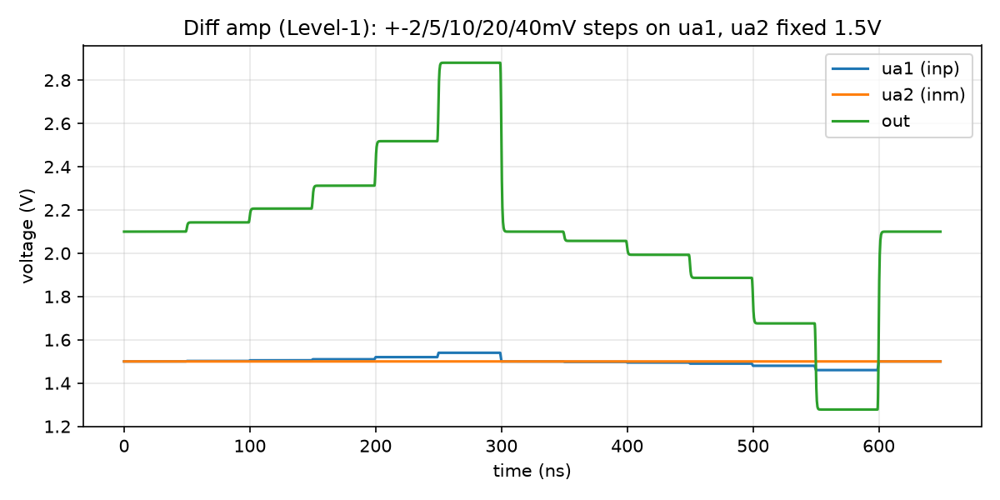

# Example: single-stage differential amplifier

Five transistors: an NMOS differential pair (`XM1`/`XM2`) biased by a real
tail current bank (`XT1`), loaded by a diode-connected PMOS current mirror
(`XM3`/`XM4`). This is the first design in the repo to draw a differential
pair *as a pair* -- `mosbius_ntail` declares which two FETs share a tail,
instead of the router inferring it (TODO.md §2, closed 2026-08-22). It
exists to prove that path end to end: draw it, route it, and see the tail
current actually reach the bitstream.

```
XM1 ua1  net2 net1 VGND  mosbius_nmos  w=4
XM2 ua2  out  net1 VGND  mosbius_nmos  w=4
XT1 net1 ibias VGND      mosbius_ntail tail=4
XM3 net2 net2 VAPWR VAPWR mosbius_pmos w=1
XM4 net2 out  VAPWR VAPWR mosbius_pmos w=1
```

`XM1`/`XM2` are the pair: gates on `ua1`/`ua2` (the two differential
inputs), sources tied together on `net1`. `XT1`'s one drawn pin, `d`, is
wired to that same `net1` -- that wiring *is* the declaration: the router
reads it as "these two FETs sourced on `net1` are the pair", claims
`ndiffpair+`/`ndiffpair-` for them, and reaches `ctrl_dpn_tail` from
`XT1`'s own `tail=4`. `XT1`'s other two pins, gate and source, aren't drawn
at all -- they're hard-wired on silicon to `ibias` and `VGND` respectively,
supplied the same implicit way every other body/bias pin in this library
is (`mosbius_lib`'s `extra=` mechanism).

`XM3` is diode-connected (gate tied to its own drain, on `net2`) and sets
the mirror's reference current; `XM4` mirrors it onto `out`, `XM2`'s drain.
That is the standard 5-transistor OTA topology, built here from the four
primitive symbols plus the new tail symbol rather than from the single
`mosbius_ota` block -- which is a perfectly good way to get a diff amp
today, and is not what this example is testing.

## Why w=4 on the pair

`XM1`/`XM2` are drawn with `w=4`, not the usual default `w=1`. A
differential-pair half has no width bits at all -- its geometry is fixed
in silicon at exactly `w=4`'s equivalent (SPEC.md §2.12) -- so any other
value gets silently corrected and reported (`R1`). Writing `w=4` up front
says what the hardware actually builds, with nothing to fix.

## Routing

```
$ python3 -m mosbius.cli route build/diffamp.spice
OK -- no errors or warnings (6 info notes hidden, use --verbose).

Device roles:
  XM1          -> ndiffpair+    w=4 (fixed)
  XM2          -> ndiffpair-    w=4 (fixed)
  XM3          -> pmos_a        w=1
  XM4          -> pmos_b        w=1
  XT1          -> ntail         tail=4

Bitstream: 00100000c020001820000000001821000000000000000030
```

Clean: no width was dropped (both halves already ask for the fixed `w=4`),
and -- the thing this example exists to check -- no `R2` warning either.
Before TODO.md's tail work order (was §2, closed 2026-08-22), this design
had no honest way to draw a tail at all;
`XT1`'s `tail=4` reaching the bitstream with nothing reported as ignored is
the proof.

The six hidden `INFO` notes are ordinary unused-bus-row bookkeeping (this
circuit only needs three of the twelve rows), the same kind every other
example produces -- see `--verbose`.

## Decoding it back

```
$ python3 -m mosbius.cli decode 00100000c020001820000000001821000000000000000030
Devices in use
  pmos_a      d=net3  g=net3  s=VAPWR  width=1  source_tied_to_VAPWR=True
  pmos_b      d=net4  g=net3  s=VAPWR  width=1  source_tied_to_VAPWR=True
  ndiffpair+  g=ua[1]  d=net3  tail=4  shared_source_tied_to_VGND=False
  ndiffpair-  g=ua[2]  d=net4  tail=4  shared_source_tied_to_VGND=False

ibias = 100.0 uA
```

Two things worth reading closely here. First, `tail=4` -- decoded straight
back out of `ctrl_dpn_tail`, matching what `XT1` asked for. Second,
`shared_source_tied_to_VGND=False`: the pair's shared tail is *not* on the
free rail tie (`ctrl_dpn_source`), because a real tail bank is doing the
job instead -- exactly TODO.md's "one or the other, never both" for
that shared node. Drop `XT1` from the schematic and re-route, and this
flips to `True` with `tail` gone -- the pre-existing behaviour every other
example still depends on.

The mirror comes back recognisably too: `pmos_a`'s drain and gate are both
`net3` (diode-connected), `pmos_b`'s gate is also `net3` (mirrored), and
`pmos_b`'s drain is `net4` -- the same net `ndiffpair-`'s drain lands on,
i.e. the amplifier's single-ended output.

## Reproducing this

From the repo root, so xschem picks up `xschemrc` (CLAUDE.md -- get this
wrong and every device comes back `IS MISSING !!!!`):

```bash
docker run --rm -v "$PWD:/work" -w /work hpretl/iic-osic-tools:latest \
  --skip bash -lc 'xschem -n -q examples/diffamp/diffamp.sch'
python3 -m mosbius.cli route build/diffamp.spice
```

## Simulation

`diffamp.sch` netlists to the *same real sky130 transistor sizing* as the
hardware blocks it stands in for, just without the switch-matrix overhead
in between (SPEC.md §3.1b's Level-1 "ideal" simulation).



`ua2` (inm) is held at a fixed 1.5V common-mode bias; `ua1` (inp) steps
through a differential offset of 2, 5, 10, 20 and 40mV, then the same five
values negative, each held for 50ns. `out` starts at **2.0998V** with both
inputs equal -- not railed to either supply, confirming the mirror and
tail bank are both biased into their normal operating region, not cut off
or saturated by the (arbitrarily chosen) 1.5V common-mode point.

The response is genuine differential gain, not a digital switch: each
step moves `out` by roughly 21x itself near the origin, and that ratio
holds essentially flat out to about ±10mV before visibly compressing
towards the rails at the largest steps -- exactly the large-signal
transfer characteristic a single differential pair is supposed to have.

| input step | output delta | gain (V/V) |
|---|---|---|
| +2mV | +42.7mV | 21.3 |
| +5mV | +106.6mV | 21.3 |
| +10mV | +212.3mV | 21.2 |
| +20mV | +418.1mV | 20.9 |
| +40mV | +780.6mV | 19.5 |
| -2mV | -42.7mV | 21.4 |
| -5mV | -106.9mV | 21.4 |
| -10mV | -213.5mV | 21.3 |
| -20mV | -424.0mV | 21.2 |
| -40mV | -822.1mV | 20.6 |

Small-signal gain is **~21.3 V/V (26.6dB)**, symmetric to within rounding
either side of the bias point, falling to ~19.5-20.6 V/V by ±40mV as the
pair starts steering all of the tail current to one side.

### Reproducing it

Netlist the schematic as above, then prepend stimulus and append the
analysis to it (strip its trailing `.end` first), same recipe as
`examples/srlatch/README.md`'s. `Iibias` is the part every other example
in this directory could skip: `ibias` is a current *input*, not a
voltage, and it has to be forced for the tail bank and mirror to do
anything meaningful at all (SPEC.md §3.4b, 100uA is upstream's own
testbench convention).

```spice
.lib /foss/pdks/sky130A/libs.tech/ngspice/sky130.lib.spice tt
Vapwr  VAPWR 0 3.3
Vgnd   VGND  0 0
Iibias VAPWR ibias 100u
Vinp   ua1 0 PWL(0 1.5 49n 1.5 50n 1.502 99n 1.502 100n 1.505 ...)
Vinm   ua2 0 1.5
* ... netlist body ...
.tran 500p 649n
.control
run
wrdata diffamp_sweep.txt v(ua1) v(ua2) v(out)
.endc
```

```bash
python3 tools/plot_tb.py build/diffamp_sweep.txt examples/diffamp/diffamp.png \
  "Diff amp (Level-1): +-2/5/10/20/40mV steps on ua1, ua2 fixed 1.5V" \
  "ua1 (inp):0" "ua2 (inm):1" "out:2"
```

`plot_tb.py`/`ngspice` need `numpy`/`matplotlib`, which live in the
container's Python, not the host's -- run both inside the same
`docker run` invocation CLAUDE.md documents for xschem/ngspice, not on
the host.

The full 13-level `PWL(...)` (the actual steps table above, each held
50ns with a 1ns transition to avoid ngspice's "non-increasing PWL time
points" warning) is mechanical to generate but tedious to type by hand;
build it with a short loop over `[0, 2, 5, 10, 20, 40, 0, -2, -5, -10,
-20, -40, 0]` rather than transcribing it.
