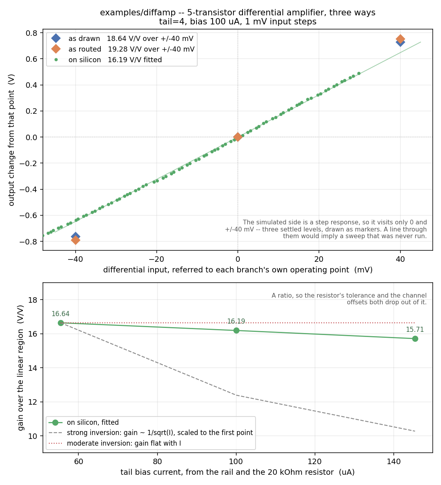

# Example: single-stage differential amplifier

*Shared background for all six examples -- as drawn vs as routed, the
testbench idiom, capacitive loading, the common gotchas -- is in
[`../README.md`](../README.md).*

Five transistors: an NMOS differential pair (`XM1`/`XM2`) biased by a real
tail current bank (`XT1`), loaded by a diode-connected PMOS current mirror
(`XM3`/`XM4`). This is the first design in the repo to draw a differential
pair *as a pair* -- `mosbius_ntail` declares which two FETs share a tail,
instead of the router inferring it (TODO.md §2, closed 2026-08-22). It
exists to prove that path end to end: draw it, route it, and see the tail
current actually reach the bitstream.

```
XM1 ua1  net2 net1 VGND  mosbius_nmos  w=4
XM2 ua2  ua4  net1 VGND  mosbius_nmos  w=4
XT1 net1 ibias VGND      mosbius_ntail tail=4
XM3 net2 net2 VAPWR VAPWR mosbius_pmos w=1
XM4 net2 ua4  VAPWR VAPWR mosbius_pmos w=1
```

`XM1`/`XM2` are the pair: gates on `ua1`/`ua2` (the two differential
inputs), sources tied together on `net1`. `XT1`'s one drawn pin, `d`, is
wired to that same `net1` -- that wiring *is* the declaration: the router
reads it as "these two FETs sourced on `net1` are the pair", claims
`ndiffpair+`/`ndiffpair-` for them, and reaches `ctrl_dpn_tail` from
`XT1`'s own `tail=4`. `XT1`'s other two pins, gate and source, aren't drawn
at all -- they're hard-wired on silicon to `ibias` and `VGND` respectively,
supplied the same implicit way every other body/bias pin in this library
is (`mosbius_lib`'s `extra=` mechanism).

`XM3` is diode-connected (gate tied to its own drain, on `net2`) and sets
the mirror's reference current; `XM4` mirrors it onto `ua4`, `XM2`'s drain.
That is the standard 5-transistor OTA topology, built here from the four
primitive symbols plus the new tail symbol rather than from the single
`mosbius_ota` block -- which is a perfectly good way to get a diff amp
today, and is not what this example is testing.

## Why w=4 on the pair

`XM1`/`XM2` are drawn with `w=4`, not the usual default `w=1`. A
differential-pair half has no width bits at all -- its geometry is fixed
in silicon at exactly `w=4`'s equivalent (SPEC.md §2.12) -- so any other
value gets silently corrected and reported (`R1`). Writing `w=4` up front
says what the hardware actually builds, with nothing to fix.

## Why the output is named `ua4`

The amplifier's output net is called `ua4` for one reason: that name is
what makes it measurable on the real chip. The router treats a net as a
package pin only if it is *named* one of `ua1`..`ua5` (`netlist.py`'s
`PORT_NAMES`) -- `ua4` reaches the outside world through `bus_B[2]`, per
the pin map in SPEC.md Sec 2.10.

Any other name, `out` included, is an ordinary internal net. It still
routes, still simulates, and still gives you the right waveform in
ngspice, where every node is probeable -- but on silicon it terminates on
a bus row with no bond wire, and there is no way to observe the gain this
example measures. Drawing a `devices/iopin.sym` on it does not change
that: the iopin only names the net and adds it to the `.subckt` port
list, so a schematic can look like it has an output port and still have
nothing you can put a scope on.

The two inputs are on `ua1`/`ua2` for the same reason, with one extra
constraint behind them: a diff-pair gate reaches only bus rows 1-3
(SPEC.md Sec 2.12), and `ua1`/`ua2` land on `bus_A[1]`/`bus_A[3]`. The
output is a pair of drains, which reach all six rows, so it is free to
take `bus_B[2]`.

## Routing

```
$ python3 -m mosbius.cli route build/diffamp.spice
OK -- no errors or warnings (1 info note hidden, use --verbose).

Device roles:
  XM1          -> ndiffpair+    w=4 (fixed)
  XM2          -> ndiffpair-    w=4 (fixed)
  XM3          -> pmos_a        w=1
  XM4          -> pmos_b        w=1
  XT1          -> ntail         tail=4

Bitstream: 00100000c020004820000000004821000000000000000030
```

Clean: no width was dropped (both halves already ask for the fixed `w=4`),
and -- the thing this example exists to check -- no `R2` warning either.
Before TODO.md's tail work order (was §2, closed 2026-08-22), this design
had no honest way to draw a tail at all;
`XT1`'s `tail=4` reaching the bitstream with nothing reported as ignored is
the proof.

The hidden `INFO` note is ordinary unused-bus-row bookkeeping (this
circuit only needs three of the twelve rows), the same kind every other
example produces -- see `--verbose`.

## Decoding it back

```
$ python3 -m mosbius.cli decode 00100000c020004820000000004821000000000000000030
Devices in use
  pmos_a      d=net3  g=net3  s=VAPWR  width=1  source_tied_to_VAPWR=True
  pmos_b      d=ua[4]  g=net3  s=VAPWR  width=1  source_tied_to_VAPWR=True
  ndiffpair+  g=ua[1]  d=net3  tail=4  shared_source_tied_to_VGND=False
  ndiffpair-  g=ua[2]  d=ua[4]  tail=4  shared_source_tied_to_VGND=False

Nets
  VAPWR    pmos_a.s  pmos_b.s
  ua[1]    ua[1] (bus_A[1])  ndiffpair+.g
  ua[2]    ua[2] (bus_A[3])  ndiffpair-.g
  net3     pmos_a.d  pmos_a.g  pmos_b.g  ndiffpair+.d
  ua[4]    ua[4] (bus_B[2])  pmos_b.d  ndiffpair-.d

ibias = 100.0 uA
```

Two things worth reading closely here. First, `tail=4` -- decoded straight
back out of `ctrl_dpn_tail`, matching what `XT1` asked for. Second,
`shared_source_tied_to_VGND=False`: the pair's shared tail is *not* on the
free rail tie (`ctrl_dpn_source`), because a real tail bank is doing the
job instead -- exactly TODO.md's "one or the other, never both" for
that shared node. Drop `XT1` from the schematic and re-route, and this
flips to `True` with `tail` gone -- the pre-existing behaviour every other
example still depends on.

The mirror comes back recognisably too: `pmos_a`'s drain and gate are both
`net3` (diode-connected), `pmos_b`'s gate is also `net3` (mirrored), and
`pmos_b`'s drain is `ua[4]` -- the same net `ndiffpair-`'s drain lands on,
i.e. the amplifier's single-ended output. The `Nets` block spells out why
that name matters: `ua[4]` is bonded to `bus_B[2]`, so the output is
readable on a package pin rather than stranded on an internal bus row.

## Reproducing this

From the repo root, so xschem picks up `xschemrc` (CLAUDE.md -- get this
wrong and every device comes back `IS MISSING !!!!`):

```bash
docker run --rm -v "$PWD:/work" -w /work hpretl/iic-osic-tools:latest \
  --skip bash -lc 'xschem -n -q examples/diffamp/diffamp.sch'
python3 -m mosbius.cli route build/diffamp.spice
```

## Simulation

`diffamp.sch` netlists to the *same real sky130 transistor sizing* as the
hardware blocks it stands in for, just without the switch-matrix overhead
in between (the design as drawn -- ideal wires, no switch matrix, SPEC.md §3.1b).


`ua2` (inm) is held at a fixed 1.5V common-mode bias; `ua1` (inp) steps
through a differential offset of 2, 5, 10, 20 and 40mV, then the same five
values negative, each held for 50ns. `ua4` starts at **1.9994V** with both
inputs equal -- not railed to either supply, confirming the mirror and
tail bank are both biased into their normal operating region, not cut off
or saturated by the (arbitrarily chosen) 1.5V common-mode point.

The response is genuine differential gain, not a digital switch: each
step moves `ua4` by roughly 20x itself near the origin, and that ratio
holds essentially flat out to about ±10mV before visibly compressing
towards the rails at the largest steps -- exactly the large-signal
transfer characteristic a single differential pair is supposed to have.

| input step | output delta | gain (V/V) |
|---|---|---|
| +2mV | +39.6mV | 19.8 |
| +5mV | +98.7mV | 19.8 |
| +10mV | +196.5mV | 19.7 |
| +20mV | +386.8mV | 19.3 |
| +40mV | +726.8mV | 18.2 |
| -2mV | -39.6mV | 19.8 |
| -5mV | -99.2mV | 19.8 |
| -10mV | -198.2mV | 19.8 |
| -20mV | -394.1mV | 19.7 |
| -40mV | -763.4mV | 19.1 |

Small-signal gain is **~19.8 V/V (25.9dB)**, symmetric to within rounding
either side of the bias point, falling to ~18.2-19.1 V/V by ±40mV as the
pair starts steering all of the tail current to one side.

Re-measured 2026-08-28, after the bias-reference correction below: the
tail bank now draws the 400 uA that `tail=4` means on silicon, where the
old ideal model gave it 200 uA. The earlier numbers on this page (base
2.0998V, ~21.3 V/V) were taken at that half-current bias point.

### Reproducing it

Netlist the schematic as above, then prepend stimulus and append the
analysis to it (strip its trailing `.end` first), same recipe as
`examples/srlatch/README.md`'s. `Iibias` is the line that matters most
here: `ibias` is a current *input*, not a voltage, and it has to be forced
for the sheet's bias generator to have anything to reference, and so for
the tail bank and mirror to do anything meaningful at all (SPEC.md §3.4b,
100uA is upstream's own testbench convention). Every design sheet now
carries that generator, so every deck needs the line -- it is no longer
something the other examples can skip.

```spice
.lib /foss/pdks/sky130A/libs.tech/ngspice/sky130.lib.spice tt
Vapwr  VAPWR 0 3.3
Vdpwr  VDPWR 0 1.8
Vgnd   VGND  0 0
Iibias VGND ibias 100u
Vinp   ua1 0 PWL(0 1.5 49n 1.5 50n 1.502 99n 1.502 100n 1.505 ...)
Vinm   ua2 0 1.5
* ... netlist body ...
.tran 500p 649n
.control
run
wrdata diffamp_sweep.txt v(ua1) v(ua2) v(ua4)
.endc
```

```bash
python3 tools/plot_tb.py build/diffamp_sweep.txt examples/diffamp/diffamp.png \
  "Diff amp (as drawn): +-2/5/10/20/40mV steps on ua1, ua2 fixed 1.5V" \
  "ua1 (inp):0" "ua2 (inm):1" "ua4 (out):2"
```

`plot_tb.py`/`ngspice` need `numpy`/`matplotlib`, which live in the
container's Python, not the host's -- run both inside the same
`docker run` invocation CLAUDE.md documents for xschem/ngspice, not on
the host.

The full 13-level `PWL(...)` (the actual steps table above, each held
50ns with a 1ns transition to avoid ngspice's "non-increasing PWL time
points" warning) is mechanical to generate but tedious to type by hand;
build it with a short loop over `[0, 2, 5, 10, 20, 40, 0, -2, -5, -10,
-20, -40, 0]` rather than transcribing it.

## On silicon

**Measured 2026-08-29** on a ttsky25a part with an Analog Discovery 3.
Fifth example on real hardware, and the second needing a bias current --
which came from a supply through a 20 kOhm resistor into pad K, since this
demoboard has no bias circuit of its own. See "Feeding it by hand, when the
board can't" in [`../README.md`](../README.md).



**This also confirmed `ua4` -> pad G**, which had never been checked on
silicon. The output sat at about 2.07 V with the inputs balanced, against a
simulated base of 1.985 V as drawn and 2.020 V as routed -- a pad tied to
ground would have read 0 V and an unconnected one would not have moved.
Five of the six analog pads are now confirmed; only `ua5` -> F is not.

### Gain

| | as drawn | as routed | on silicon |
|---|---|---|---|
| small-signal gain | 19.8 V/V | 19.80 V/V | **16.19 V/V** |
| output base | 1.985 V | 2.020 V | ~2.07 V |

Silicon is **18% below** the as-drawn small-signal gain. Two known effects
account for part of that before anything else is invoked. The AD3's 1 MOhm
input sits across this amplifier's ~20 kOhm output and is worth about 2%,
and every simulated number on this page is at `rprobe=10meg cprobe=10p`;
re-running the testbench at the instrument's own 1meg/24p was deliberately
skipped here, so that 2% is uncorrected.

**The larger candidate is the corner.** This part is `ss`, established from
the ring oscillator and the inverter, while every published number here is
`tt` -- and gain is exactly the sort of quantity a corner moves.
`tools/sweep_corners.sh` re-runs a testbench at `ss` without touching the
committed schematics. That is the next test, not a conclusion to draw yet.

Worth recording that **`examples/otabuf/` came out the same way the same
day**: its closed-loop shortfall from unity was 1.38x the routed model's,
which also means less gain on silicon than modelled. Two independent
circuits on one part, same sign.

### Gain against tail current

The bias comes from a supply this tooling can set, so measuring at three
currents costs almost nothing -- and it is a ratio, so the resistor's
tolerance and the scope's channel offsets both drop out.

| tail current | gain | fit residual | ua1 at out = 2.0 V |
|---|---|---|---|
| 55.5 uA | 16.64 V/V | 8.9 mV rms | 1.4987 V (-1.3 mV) |
| 100.0 uA | 16.19 V/V | 8.3 mV rms | 1.5057 V (+5.7 mV) |
| 145.4 uA | 15.71 V/V | 7.2 mV rms | 1.5105 V (+10.5 mV) |

**Gain barely moves: 1.059x across 2.6x of current.** Strong-inversion
square law predicts 1.619x -- gain is `gm x Rout`, `gm` goes as sqrt(I) and
`Rout` as 1/I, so gain goes as 1/sqrt(I). Gain roughly flat with current is
instead what *moderate* inversion gives, where `gm` is proportional to I
rather than its square root and the two dependencies cancel. That is an
inference from one part measured once, not something verified here, and the
lower panel of the figure plots both predictions against the three points
so a reader can judge it.

Residuals under 10 mV rms over more than a volt of output swing: the
amplifier is very linear across the window swept, and the 1 mV input steps
resolve it. A coarser sweep would not have -- the whole transition is about
80 mV wide, which is what 20 V/V on 3.3 V rails means.

The operating point shifts about 12 mV across that bias range. Read it as
an observation rather than as the pair's input offset voltage: which input
counts as "centred" depends on what output level you nominate, and this one
nominates 2.0 V. What is solid is that the offset is *small*, a few
millivolts, against a simulated sheet whose offset is exactly zero by
construction -- perfectly symmetric, and ngspice is noiseless. It is the
one quantity on this page the model cannot produce at all.

### Two analysis mistakes worth not repeating

Both were caught before the numbers above, and both would have looked
plausible if they had not been.

**Peak local slope is not the gain here.** The first pass took the largest
local slope over a +/-4 mV least-squares window and called it peak gain,
getting 17.78 V/V. But the local slope scatters about +/-0.8 V/V point to
point, so its maximum is a noise pick; and it rises monotonically from
about 14 to 17 V/V across the swept window, so there is no peak in there to
find. Fitting the whole linear region is well conditioned and reproducible.

**The centring rule was wrong, and the output level said so.** The
operating point was first taken as the input where the output sits midway
between the extremes of the coarse sweep -- which landed 15 to 32 mV from
where the gain actually peaks, because this amplifier's swing is not
symmetric about its bias point. The tell was the output level: the wrong
rule put it at 1.82 V, the peak-gain point puts it at 2.07 V, and the sheet
predicts 1.985/2.020 V. That mattered beyond the offset number, because the
`+/-N mV` gain chords are measured *from* the centre, so a misplaced centre
made them spuriously asymmetric -- it reported the positive side steeper
where both simulated branches say the negative side is.

### Step response, measured

**Measured 2026-08-29** with `tools/measure_settling_ad3.py diffamp`, which
steps `ua1` by +/-40 mV about the measured operating point and fits the
output's exponential settle.

| | value |
|---|---|
| **on silicon** | **489.5 ns** (sd 3.75 over 16 captures) |
| published as routed, 10 pF probe | 220 ns |
| **corrected to this probe's 24 pF** | **430 ns** |

Silicon is **1.14x** the corrected figure. The correction is not optional:
a settling time constant is `Rout x C`, the published pair was taken at
`cprobe=10p`, and an Analog Discovery presents about 24 pF -- so at
`Rout` = 15 kOhm the node goes from 14.7 pF to 28.7 pF and the expected
time constant roughly doubles. Comparing against the raw 220 ns would have
shown a 2.2x disagreement that is entirely the instrument.

Two things make the number trustworthy rather than merely reproducible.
The stimulus edge is 66 ns, **7.4x faster** than the settle, so this is the
circuit and not the generator -- unlike `examples/otabuf/`'s slew, where
that ratio is 1.1x and the measurement has to be rescued by sweeping the
bias. And the fit cross-checks against a second route to the same quantity:
the output's own 10-90% is 1063 ns, an exponential's 10-90% is 2.197 tau,
so that implies 484 ns against the fitted 490 -- **1.1% apart**. A large gap
there would have meant the settle is not a single pole and the fit was
describing something else.

### Not measured

Bandwidth as a frequency response. The step response above covers settling;
a gain-bandwidth measurement would need a swept sine.

To reproduce:

```bash
python3 tools/measure_ibias_clamp_ad3.py --resistor 20000   # confirm pad K, set the rail
python3 tools/measure_diffamp_ad3.py                        # programs, sweeps, reports
python3 tools/plot_diffamp_comparison.py                    # redraws the figure
```

## Load capacitors in `tb_diffamp.sch`

The usual pair, both `'cprobe'` (plus a matching `'rprobe'`) with `.param cprobe=10p` -- see
[`../README.md`](../README.md). Here the load does not affect the gain
at all, only how long you have to wait for it. That is worth stating
plainly, because an earlier version of this section said the opposite.

## Step response and settling

The output of this amplifier is a high-impedance node -- roughly **9
kOhm** as drawn and **15 kOhm** as routed -- so `cprobe` alone gives the
step response a time constant of about **90 ns** as drawn and **220 ns**
as routed, where the bond pad adds ~5pF on top of `cprobe` and the switch
matrix adds series resistance. In 10%-90% terms, the numbers this section
used to quote, that is about 200 ns and 470 ns. Both were measured off
`build/diffamp_tb_out_*.txt` on 2026-08-28 by fitting the step; an
earlier version of this paragraph called the node "roughly 20 MOhm",
which is three orders out and contradicted its own time constants --
20 MOhm against 10pF would be 200 *microseconds*. The correction matters
beyond tidiness: at 20 MOhm a 10 MOhm scope probe would halve the gain,
while at 15 kOhm it costs 0.1%, which is why the probe model added in
`tb_diffamp.sch` moved every level here by about 2 mV and nothing more.
Five routed time constants is 1.1us, and the 10%-90% figure gives 2.4us,
which is why `tb_diffamp.sch` holds each input level for 2.5us and
samples 5ns before the end of the plateau:

```
Vinp  PWL(0 1.5  999n 1.5  1000n 1.54  3499n 1.54  3500n 1.46  5999n 1.46  6000n 1.5)
tran 5n 6.5u
```

Measured 2026-08-28, at `cprobe=10p (with rprobe=10meg)`:

| | `out` base | after `+40mV` | after `-40mV` | gain + | gain - |
|---|---|---|---|---|---|
| as drawn | 1.985 V | 2.714 V | 1.222 V | 18.22 V/V | 19.08 V/V |
| as routed | 2.020 V | 2.771 V | 1.228 V | 18.78 V/V | 19.80 V/V |

**The two agree to within about 3%, and that is the expected answer.** At
DC no current flows into a capacitor, so the pad's and the switch matrix's
series resistance drop no voltage at all: everything the routed model adds
is resistance and capacitance, and neither changes a settled gain. So the
switch matrix costs this circuit **bandwidth, not gain** -- the exact
mirror of `examples/inverter/`, where a fast edge is dominated by the pad.

The residual 3% is a real model difference, not noise: the as-drawn tail
bank and mirror are the library's idealised `mosbius_ntail`/`mosbius_pmos`
against the routed branch's actual `diff_n` and `mirror_p` silicon. Both
now sit at the same 400 uA tail current, which is what makes the
comparison meaningful at all.

An earlier version of this table reported the two branches agreeing to
0.5%. That was a coincidence of two different bias points: the as-drawn
tail ran at 200 uA and the routed one at 400 uA, and the gains happened to
land close together. See below.

The ~5% difference between the positive and negative gains appears
identically in both branches, which makes it a real property of the
amplifier -- its swing is not symmetric about the operating point -- and
not a measurement artifact.

### The bias-reference correction (2026-08-28)

Every number on this page moved on 2026-08-28, and the reason is worth
reading even if you only care about your own circuit.

The ideal device symbols each used to carry their own copy of the chip's
bias reference: a diode-connected transistor on the `ibias` net, plus the
slave that mirrors it. Silicon has exactly one reference -- pin `ua[0]`
feeds `mirror_n`'s reference leg, and every programmable leg, tail bank
and OTA tail is a slave off that one gate voltage, with `ibias_p` made
from it for the PMOS side. Replicating the reference per device meant two
things went wrong: N devices on a sheet split the one reference current N
ways, and `mosbius_ntail`'s private reference (W=20 nf=4) was twice the
chip's (W=10 nf=2), so `tail=4` delivered 200 uA where silicon delivers
400 uA.

The fix moves the reference where it belongs -- one generator in
`mini_mosbius.sch`, copied into every design sheet, matching the chip's
own `ua[0]` -> `mirror_n` -> `ibias_p` -> `mirror_p` chain with those
schematics' own device sizes. The device symbols keep only their slave
legs, whose existing width expressions then come out right against the
real reference: `ratio=N` is N x ibias, and `tail=N` is N x ibias, which
is exactly what the hardware's own cycler encoding means.

For this example that doubled the as-drawn tail current, which is why the
gain fell from ~21.3 to ~19.8 V/V and the output's quiescent point moved
down. The as-drawn model is now the more accurate one, not the more
flattering one. `examples/currentsource/` is the example that found this;
`examples/inverter/`, `examples/srlatch/` and `examples/ringosc/` were
re-measured after the change and are unchanged to the last digit, since
none of them uses a bias-referenced device.

### Why the earlier numbers here were wrong

This section previously reported 7.8 and 2.6 V/V as drawn and 3.3 and 0.03
V/V as routed, and explained them as the load crushing the gain. Every one
of those numbers was a sample taken before the output had arrived. The
plateaus were 100 ns against a 200-470 ns time constant, so the `FIND`
measurements caught the response less than half way up, and the routed
branch -- being the slower of the two -- looked like a far worse
amplifier when it is an equally good one that takes longer. The
`0.96 V/V` recorded at the older 100pF load was the same error, worse.

The tell was visible in the raw file without re-running anything:
`out_drawn` read 2.313 V half way through the plateau and 2.457 V at the
end, and never returned to its baseline afterwards. A measurement that
still moves while you take it is not a measurement of a settled quantity.

### The `gain_*` measures used to fail

All four reported `failed` while printing a plausible number. The cause
was not an ngspice quirk, as `TODO.md` recorded for a while: `PARAM=` is a
feature of the `.measure` netlist card, not of the `meas` command inside a
`.control` block. ngspice substituted the vector values first and then
tried to parse `param=7.761175e+00` as a function name, which is why the
computed value appeared in the failure message and made the failure look
cosmetic.

The fix is the idiom `tb_ring.sch` already used for frequency:

```
let gain_drawn_pos = (vout_drawn_pos - vout_drawn_base)/0.04
print gain_drawn_pos
```

`vout_*` are real `meas` results, so they are already vectors in scope.

## Testbench net names

`tb_diffamp.sch` follows the shared convention -- no suffix for a net shared
between the two instances, `_drawn`/`_routed` for one that differs per
instance. See [`../README.md`](../README.md).
