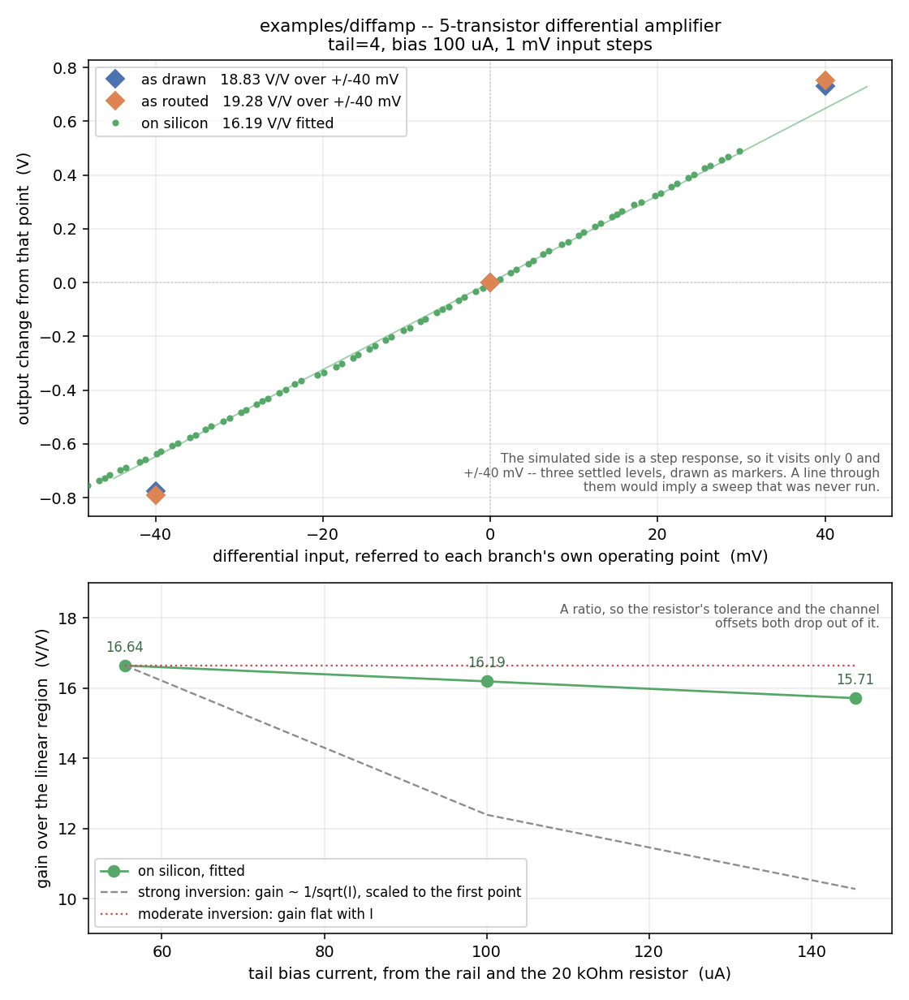

# Differential amplifier

Five transistors: an NMOS differential pair (`XM1`/`XM2`) biased by the
chip's tail current bank (`XT1`), loaded by a diode-connected PMOS current
mirror (`XM3`/`XM4`). The pair's gates are the two inputs on `ua1` and
`ua2`, their sources are tied together, and `XT1`'s single drawn pin is
wired to that shared source -- which is how the router is told those two
FETs are a pair rather than two independent FETs. The mirror turns the
pair's differential current into a single-ended output on `ua4`.



*Fig. 1. Output on `ua4` against the differential input, and gain against
tail current: as drawn (ideal wires), as routed (through the configured
switch matrix, from `mosbius simulate`), and measured on a ttsky25a chip
with an Analog Discovery 3. Simulated at the `tt` corner with the default
10x probe.*

| | as drawn | as routed | on silicon |
|---|---|---|---|
| small-signal gain | ~19.5 V/V | 19.77 V/V | 16.19 V/V |
| output base | 2.012 V | 2.018 V | ~2.07 V |

## Try this

Change the tail current and see how little the gain moves. `XT1`'s `tail`
property takes 2, 4, 6 or 8, in multiples of the chip's reference current,
and each value is a different bitstream, so this is four route-and-measure
runs rather than one sweep. Strong-inversion theory says gain should scale
with the square root of the tail current; check whether these devices
agree, and what that says about which region they are working in.

## Reproducing the numbers

```bash
sh tools/check_example_sim.sh diffamp                       # as drawn and as routed, in the container
python3 tools/measure_ibias_clamp_ad3.py --resistor 20000   # set the bias rail
python3 tools/measure_diffamp_ad3.py                        # on silicon, on the host
python3 tools/plot_diffamp_comparison.py                    # the figure
```
