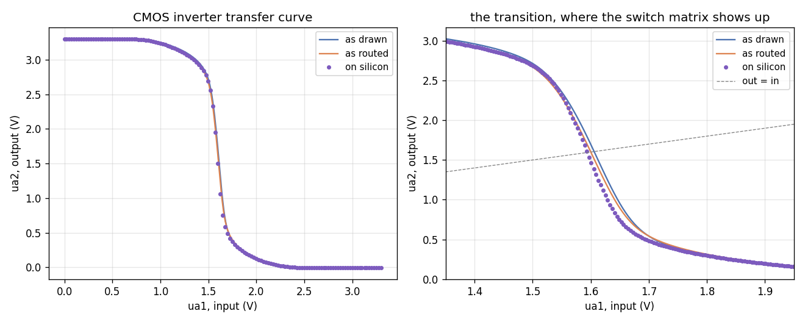

# CMOS inverter

An NMOS and a PMOS transistor share a gate and a drain: the input drives
both gates, and the output is pulled to ground or to the supply depending
on which device is on. It is the smallest circuit that exercises the whole
pipeline.



*Fig. 1. The inverter's DC transfer curve as drawn (ideal wires), as
routed (through the configured switch matrix, from `mosbius simulate`),
and measured on a ttsky25a chip with an Analog Discovery 3. The simulated
curves are at the `tt` corner with the default 10x probe (`rprobe=10meg`,
`cprobe=10p`).*

| | as drawn | as routed | on silicon |
|---|---|---|---|
| trip point (out = in) | 1.605 V | 1.600 V | 1.599 V |
| small-signal gain there | -14.79 V/V | -14.49 V/V | -16.90 V/V |
| 10%-90% rise, 500 ns pulse | 8.16 ns | 24.63 ns | not measured |

## Try this

Widen the PMOS and watch the rise time. `M2`'s `w` property selects how
many of the four device slices are switched in, so `w=1` through `w=4` are
all real chip configurations, each with its own bitstream.
`inverter_w4.sch` is this circuit with that one property changed; routing
and simulating it gives a new pair of rise times, and programming it gives
a new curve on the bench.

Note that only the width is programmable. Channel length is fixed at
0.5 um in silicon, so editing `L` in the device library would simulate a
transistor the chip cannot build.

## Reproducing the numbers

The first line runs in the IIC-OSIC-TOOLS container; the rest run on
the host. [`../README.md`](../README.md#running-each-examples-commands)
has the docker invocation.

```bash
sh tools/sim/check_example_sim.sh inverter   # as drawn and as routed, in the container
python3 tools/ad3/measure_inverter_ad3.py    # on silicon, on the host
python3 tools/plot_inverter_comparison.py    # the figure and the table
```
