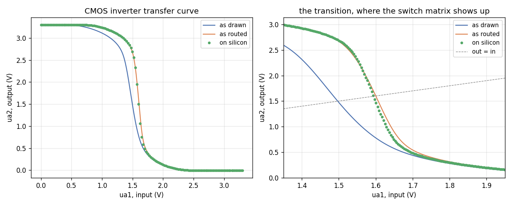

# Example: CMOS inverter

*Shared background for all four examples -- as drawn vs as routed, the
testbench idiom, capacitive loading, the common gotchas -- is in
[`../README.md`](../README.md).*

The simplest circuit that exercises the whole pipeline: two transistors,
gates tied together as the input, drains tied together as the output. This
is also [the first circuit tnt built](https://www.tinytapeout.com/news/mini-mosbius/)
when bringing up the real mini-MOSbius silicon, so it's a genuine point of
comparison, not just a convenient toy.

`inverter.sch` was drawn by hand in xschem on 2026-08-21, replacing an
earlier machine-generated version built against the pre-redraw symbol
geometry. It is built on `mini_mosbius.sch` from
`mosbius_nmos.sym`/`mosbius_pmos.sym`, wired to `ua1` (input), `ua2`
(output), `VGND` and `VAPWR` -- which is exactly what `TUTORIAL.md` walks
you through drawing, so this is the finished article for that walkthrough
rather than a machine-made stand-in.

```
XM1 ua1 ua2 VGND VGND mosbius_nmos w=1
XM2 ua1 ua2 VAPWR VAPWR mosbius_pmos w=1
```

Watch the pin order when you draw it: `mosbius_nmos` has its **drain** at
the top and its source at the bottom, and `mosbius_pmos` is the other way
up -- source at the top, drain at the bottom. So the two devices in an
inverter are not drawn the same way up, and flipping both the same
direction leaves exactly one of them reversed. That is not a circuit that
fails to route -- it routes clean and passes the safety checker -- it just
quietly costs a bus row, because only the *source* terminal has a free tie
to its rail (`ctrl_nfeta_source`/`ctrl_pfeta_source`).

`check.py`'s `D2` warns about exactly this shape -- drain on the rail the
body is tied to, source on a net -- but only when that source is an
*internal* net, not when it is a `ua[]` pin. In this inverter the output is
`ua2`, a pin, so a reversed device here still routes without a word. The
narrow rule is deliberate: with a package pin involved there are circuits
that legitimately look like this. Draw it carefully rather than relying on
the check.

## Routing

```
$ python3 -m mosbius.cli route build/inverter.spice
OK -- no errors or warnings (1 info note hidden, use --verbose).

Device roles:
  XM1          -> nmos_a        w=1
  XM2          -> pmos_a        w=1

Bitstream: 080000004010000001000000000000000040000400000000
```

Verified two ways beyond "the checker didn't complain": `mosbius decode` on
that bitstream reads back the exact same circuit (gates tied together on
`ua[1]`, drains tied together on `ua[2]`, sources tied to their own rails),
and it matches `tests/conftest.py`'s `make_inverter_config()` -- a
completely independent, hand-built-from-the-bit-map reference from M1,
before the router existed.

## Simulation

`inverter.sch` netlists to the *same real sky130 transistor sizing* as the
hardware block it stands in for, just without the switch-matrix overhead in
between (the design as drawn -- ideal wires, no switch matrix, SPEC.md Sec 3.1b) -- so this is what
the circuit does electrically, with the real switch-matrix parasitics left
out.


At `w=1` on both transistors (the schematic above) with a 100pF load,
10-90% rise time is **84.4 ns**. That 100pF is a heavy load -- see "What
the two load capacitors are" below; the testbench further down uses 10pF,
and these two figures and their waveform images are the only numbers on
this page still taken at 100pF. tnt's own hardware bring-up of the same
circuit -- real silicon, not simulation -- [reported "about a 50ns rise
time"](https://www.tinytapeout.com/news/mini-mosbius/) at the same starting
configuration, then "around 25ns" after widening the PMOS to `w=4` ("P
mosfets are weaker than N mosfets, and one way to compensate is by
increasing their width").

`inverter_w4.sch` is the same circuit with `M2`'s width raised to 4 --
the only difference between the two files is that one property --
reproducing that second measurement:


At `w=4`, rise time is **21.1 ns** -- about 4x faster than the `w=1` case,
tracking the published ~50ns -> ~25ns improvement (a 2x change) reasonably
well in direction and roughly in magnitude, if not exactly: this
simulation's absolute numbers run somewhat higher than the published ones
(84ns vs ~50ns at `w=1`). That gap is the load, not the model. An as-drawn
model leaves out the chip's parasitic resistance and capacitance, which
makes it *faster* than silicon, not slower -- so omission cannot explain a
number above the measurement, and the 100pF load used here, heavier than
whatever tnt probed with, can. At the 10pF the testbench below uses, the
same as-drawn model gives 8.9ns and the ordering comes out right: as drawn
is faster than as routed, which is faster than silicon. See "What this does
and doesn't prove" below.

## What this does and doesn't prove

The **published trise numbers are real silicon**, from tnt's own hardware
bring-up -- not from this project's simulation. What the numbers above
show is that this project's as-drawn ideal simulation, run through the
actual toolchain (draw -> netlist -> route -> check, all verified against
real xschem/ngspice), lands in the same regime and responds to the same
`w=1` vs `w=4` change in the same direction -- a real, if partial,
cross-check of the device models in `xschem/mosbius_lib/`.

**That is no longer the only hardware evidence on this page.** As of
2026-08-28 this project has its own bring-up: SPEC.md Sec 8.4's `--verify`
criterion is met (bitstream loaded and read back on a ttsky25a chip), and
"What running it shows" below measures this exact routed configuration on
that chip and compares it against both models. Where tnt's figures are a
transient on a different bench with an unknown probe, the measurement
below is a DC curve taken through the routing this repo generates, so it
tests the *routed* model rather than only the device models.

## As drawn vs as routed, side by side: `tb_inverter.sch`

Everything above was the as-drawn model only, produced by netlisting `inverter.sch`
directly and hand-patching stimulus into the resulting SPICE text -- not a
real xschem testbench. `tb_inverter.sch` replaces that with the workflow
`mosbius simulate` (SPEC.md Sec 3.7) is actually meant for:
a real top-level testbench with two instances of the same design, `x1`
(ideal, ordinary hierarchy) and `x2` (a duplicate, its `spice_sym_def`
instance property pointing at a real, silicon-accurate netlist), sharing
one stimulus and one set of rails, so the *only* difference between
`out_drawn` (x1's output) and `out_routed` (x2's output) is as-drawn vs as-routed
fidelity. This is the same `spice_sym_def` swap-in mechanism used in
[github.com/mattvenn/tt08-analog-ring-osc's `tb_ring.sch`](https://github.com/mattvenn/tt08-analog-ring-osc/blob/main/xschem/tb_ring.sch)
to compare an ideal schematic against a post-layout extraction -- here the
"extraction" is `mosbius simulate`'s output instead of a magic PEX run.

Both `x1` and `x2` are the same symbol, `xschem/mosbius_lib/mini_mosbius.sym`
-- the mini-MOSbius chip as a block, nine real pins and nothing else, which
is identical for every design. What makes an instance stand for a
*particular* design is its `schematic=` attribute, not a symbol of its own:

| instance | `schematic=` | netlists as | is |
|---|---|---|---|
| `x1` | `tcleval([file normalize examples/inverter/inverter.sch])` | `.subckt inverter` | the inverter **as drawn** -- ideal wires, no switch matrix |
| `x2` | `inverter_routed` (+ `spice_sym_def`) | `.subckt inverter_routed` | the same inverter **as routed** onto the chip, from `mosbius simulate` |

The subcircuit name follows the `schematic=` file, which is why `x1` comes
out as `inverter` and not as `mini_mosbius`.

`x1`'s absolute `tcleval([file normalize ...])` form is load-bearing and is
not decoration. `schematic=` is resolved relative to the *symbol's* own
directory, and this symbol lives in `xschem/mosbius_lib/`, so both
`schematic=inverter` and `schematic=inverter.sch` look for a file that
isn't there and quietly fall back to the symbol's own empty body. You then
get `.subckt inverter` containing no transistors at all -- a netlist that
runs, and measures nothing. Verified both ways 2026-08-24.
`xschem/mosbius_lib/tb_template.sch` uses the same absolute form for the
same reason, so copying it to your own directory keeps working.

### Stimulus and ground

`Vin` pulses `in` (the chip's `ua1`) from 3.3V down to 0 at t=10ns,
shared by both
instances. The *input* falls, so the inverter's output *rises* -- which is
why both measurements are `RISE` edges on `out_drawn`/`out_routed` while
the thing driving them is a falling edge. Everything above this section
was produced by hand-patching stimulus into a netlist; this is the same
methodology driven from a real xschem testbench instead.

`Vgnd VGND 0 0` in the ngspice block is not optional -- xschem never emits
SPICE node 0, so without it the whole circuit floats. Every testbench here
carries it; `examples/ringosc/README.md`'s "How `tb_ring.sch` is set up"
has the full story, including what happens when it is missing.

### Regenerating `build/inverter_routed.spice`

`x2`'s `spice_sym_def` points at `build/inverter_routed.spice`. Everything
in `build/` is generated, so that file is never in a fresh clone, and the
testbench cannot simulate without it.

You do not have to remember any of this. With `tb_inverter.sch` open,
ctrl-click the **generate routed spice** arrow on the sheet: it netlists
`inverter.sch`, routes it, and writes the routed netlist, reporting each
step in xschem's process window. Press Netlist again afterwards to pick it
up.

The same thing from a shell at the top of the repo, for any design:

```bash
sh tools/regenerate_routed.sh examples/inverter/inverter.sch
```

which is just these three steps:

```bash
xschem -n -q examples/inverter/inverter.sch
python3 -m mosbius.cli route build/inverter.spice --out build/inverter.mosbius.json
python3 -m mosbius.cli simulate build/inverter.mosbius.json
```

No `PDK=sky130A` export is needed any more: the repo's own `xschemrc`
pins the variant (it used to be possible to netlist with sky130A's symbols
but a `.lib` path pointing into `ihp-sg13g2`, which produces a netlist that
looks perfect and cannot simulate).

The routed bitstream should still read
`080000004010000001000000000000000040000400000000`, matching the "Routing"
section above -- if it doesn't, something about the drawn circuit has
changed. Routing is deterministic for an unchanged schematic, so deleting
`build/` and starting again reproduces exactly this bitstream.

If you netlist the testbench *without* generating it first, you are told
so at that moment rather than left to decode a SPICE error two steps later:
`xschemrc`'s `mosbius_routed_include` puts the explanation and the commands
into the netlist as comments, and raises one dialog in the GUI. The
`.include` is still emitted, so ngspice stops rather than quietly
simulating a comparison with nothing on one side.

`build/tb_inverter.spice` is then a complete, self-contained deck --
`.control` already has a real `tran`, two `.meas` rise-time measurements
(`trise_drawn`, `trise_routed`), and `wrdata` output for
`in`/`out_drawn`/`out_routed`.

### What running it shows

The same circuit three ways: as drawn (ideal wires), as routed (through
the real configured switch matrix, `mosbius simulate`) and as measured on
silicon. All three are current as of 2026-08-28, on the routing the
router produces today (`0800000040100000...`), with the probe at its
defaults (`cprobe=10p`, `rprobe=10meg`) for the two simulated columns and
an Analog Discovery 3 on the bench.



| | as drawn | as routed | on silicon |
|---|---|---|---|
| trip point (out = in) | 1.495 V | **1.600 V** | **1.599 V** |
| small-signal gain there | -8.5 V/V | -14.5 V/V | -16.9 V/V |
| VOH | 3.2999 V | 3.2999 V | 3.3031 V |
| VOL | 0.0000 V | 0.0000 V | -0.0071 V |
| 10%-90% rise, 500ns pulse | 8.90 ns | 24.63 ns | not measured |

Reproduce the simulated columns with `sh tools/check_inverter_sim.sh`
inside the container, the measured one with `python3
tools/measure_inverter_ad3.py` on the host, and the figure and table with
`python3 tools/plot_inverter_comparison.py`.

**The trip point is the headline.** As drawn puts it at 1.495 V. Routing
the same circuit through the matrix moves it to 1.600 V. Silicon says
1.599 V. A millivolt is well inside the measurement's own repeatability
(+/-2 mV across runs), so treat it as luck in the last digit -- but a
105 mV shift predicted and 104 mV observed is not luck, and it is the
first independent evidence that `mosbius simulate`'s model of the switch
matrix is right rather than merely plausible.

**The gain does not agree as well**, and the gap is real: -14.5 V/V
routed against -16.9 V/V measured, about 17% low. Both figures are
least-squares fits over +/-50 mV around each curve's own trip point,
which matters -- a peak slope read off the steepest pair of points
depends on how finely you swept (the same silicon gives -17.5 V/V at
25 mV steps and -20.0 V/V at 4 mV, because on fine steps the noise on
each point is a larger share of the difference between them). Fitted, the
two silicon sweeps agree with each other to 0.1 V/V, so the disagreement
with the model is not a sweep artifact. A model that lands the trip point
to a millivolt while under-predicting the slope by a sixth is saying
something specific, and output resistance is the place to look, since the
switches are evidently right about where the transition sits.

**The levels prove less than they look.** VOH sits 3 mV above the
simulated rail and VOL 7 mV below ground, which is within a calibrated
AD3's own accuracy, not a measurement of anything on the chip. The deck
says a 10 MOhm probe droops VOH by 0.33 mV; nothing on this bench can see
that.

An earlier version of this section reported the trip point as 1.555 V and
VOL as -45 mV, from an uncalibrated instrument. Calibration moved both
by the same 44 mV, which is the difference between the two channels'
offsets: the trip point is where channel 2 crosses channel 1, so unlike
the gain -- a ratio of differences, one per channel -- it does not
survive an offset. Calibrate first (WaveForms, Settings -> Device Manager
-> Calibrate).

### What the routed model is mostly adding

Set `cprobe=100p` and re-run and the two rise times become 88.43 ns and
130.33 ns, a ratio of 1.47 against 2.77 at the default 10 pF. Two loads
separate two effects: a purely resistive difference would hold the ratio
constant and a purely capacitive one would shrink it at the larger load,
so it is both, and solving them together puts roughly **10.8 pF of extra
capacitance** on the routed output against a series switch resistance of
about **33%** of the drive resistance.

That capacitance is the bond pad, not the switch matrix. It matches what
`mosbius simulate` instantiates on a used package pin: the pad model in
`mosbius/data/mosbius_device_library.spice` carries 2 pF at the pin and
3 pF behind its bond inductance, on top of the drain/source capacitance
of a 60um NMOS and 180um PMOS ESD pair. Row coupling (~43 fF/switch) and
bus-wire capacitance (~900 fF/row) really are swamped by it.

Read with the ring oscillator, the two examples cross-check
`mosbius simulate` in the two regimes a design can be in:
switch-matrix-dominated (the ring: stages drive each other, no pad in the
signal path) and pad-and-load-dominated (this inverter: a real package
pin into a probe).

### The probe

`Cprobe_drawn`/`Rprobe_drawn` and `Cprobe_routed`/`Rprobe_routed` are the
meter, at `.param cprobe=10p` and `.param rprobe=10meg` -- a 10x passive
probe. Why the two instances must match, why the routed one is not zero,
why the value moves the conclusion as much as it does, and what to set
for an Analog Discovery or a 1x probe instead are in
[`../README.md`](../README.md) -- "What the routed model is mostly adding"
above is the worked case that section is built on.

### Runtime

About 35s in the IIC-OSIC-TOOLS container, of which ~13s is
sky130 library parsing and ~20s is building the circuit and solving the DC
operating point -- the transient itself is about a second. The `.option`
line sets `reltol=0.01` rather than ngspice's `1e-3` default, which is what
buys that: it took the run from ~110s to ~35s and moved both rise times by
under 0.1%. The operating point converges only after dynamic and true gmin
stepping both fail and ngspice falls back to source stepping, which is
where most of the remaining time goes; `rshunt` and `gmin` adjustments did
not help that.

An earlier version of this section said running both branches together
needed a higher-RAM machine and OOMed at ~1.9GB on the usual dev host.
That is no longer true and has been removed: it runs here repeatedly,
in well under a minute. The full-matrix decks in `tools/` that hit that
ceiling are much larger than what `mosbius simulate` emits for one design.

## Testbench net names

`tb_inverter.sch` follows the shared convention -- no suffix for a net shared
between the two instances, `_drawn`/`_routed` for one that differs per
instance. See [`../README.md`](../README.md).
