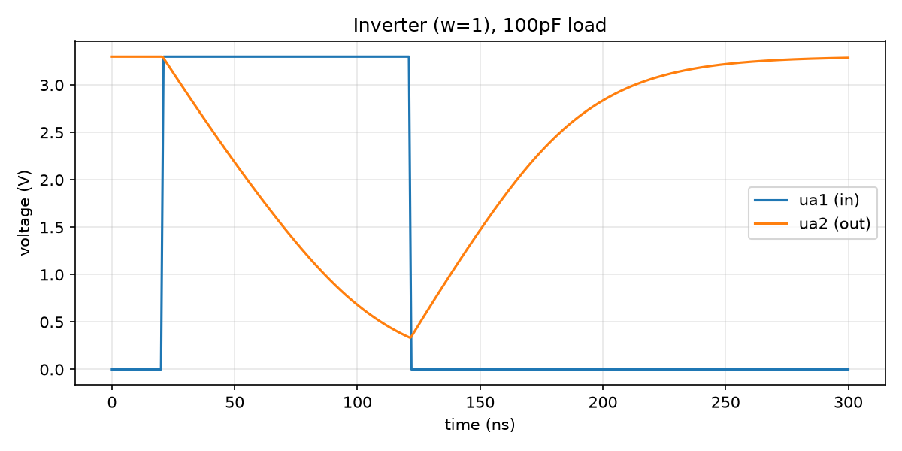
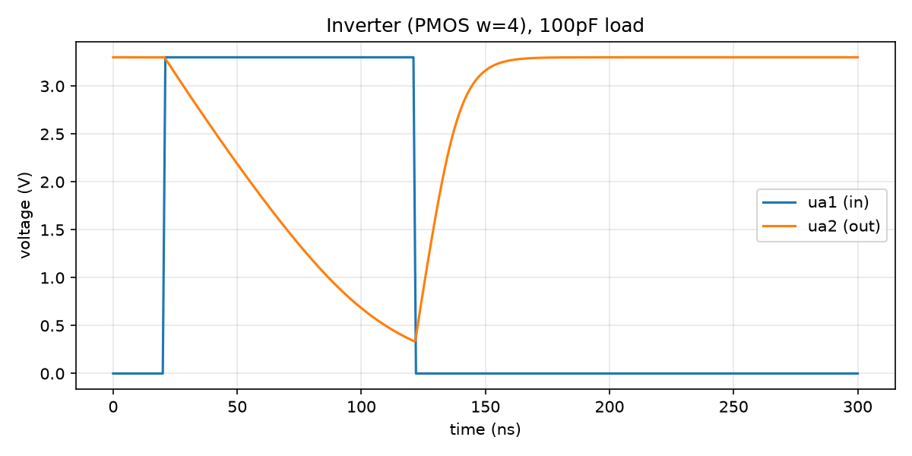

# Example: CMOS inverter

The simplest circuit that exercises the whole pipeline: two transistors,
gates tied together as the input, drains tied together as the output. This
is also [the first circuit tnt built](https://www.tinytapeout.com/news/mini-mosbius/)
when bringing up the real mini-MOSbius silicon, so it's a genuine point of
comparison, not just a convenient toy.

`inverter.sch` was generated by `tools/gen_example_schematic.py` from the
netlist below (see that script's docstring for why: hand-placing xschem
wire coordinates is exactly the kind of thing that silently produces a
floating pin if you get one coordinate wrong, which is exactly what
happened on the first attempt at these example schematics -- see the
commit history). It's a real, openable, netlistable schematic built from
`mosbius_nmos.sym`/`mosbius_pmos.sym`, wired to `ua1` (input), `ua2`
(output), `VGND`, and `VAPWR` -- functionally identical to what
`TUTORIAL.md` walks you through drawing by hand.

```
nfeta_0 ua1 ua2 VGND VGND mosbius_nmos w=1
pfeta_1 ua1 ua2 VAPWR VAPWR mosbius_pmos w=1
```

## Routing

```
$ python3 -m mosbius.cli route build/inverter.spice
OK -- no errors or warnings (10 info notes hidden, use --verbose).

Device roles:
  nfeta_0      -> nmos_a
  pfeta_1      -> pmos_a

Bitstream: 080000004010000001000000000000000040000400000000
```

Verified two ways beyond "the checker didn't complain": `mosbius decode` on
that bitstream reads back the exact same circuit (gates tied together on
`ua[1]`, drains tied together on `ua[2]`, sources tied to their own rails),
and it matches `tests/conftest.py`'s `make_inverter_config()` -- a
completely independent, hand-built-from-the-bit-map reference from M1,
before the router existed.

## Simulation

`inverter.sch` netlists to the *same real sky130 transistor sizing* as the
hardware block it stands in for, just without the switch-matrix overhead in
between (SPEC.md Sec 3.1b's Level-1 "ideal" simulation) -- so this is what
the circuit does electrically, with the real switch-matrix parasitics left
out.



At `w=1` on both transistors (the schematic above) with a 100pF load (a
plausible scope-probe + PCB + pad figure, not something you'd see on-chip),
10-90% rise time is **84.4 ns**. tnt's own hardware bring-up of the same
circuit -- real silicon, not simulation -- [reported "about a 50ns rise
time"](https://www.tinytapeout.com/news/mini-mosbius/) at the same starting
configuration, then "around 25ns" after widening the PMOS to `w=4` ("P
mosfets are weaker than N mosfets, and one way to compensate is by
increasing their width").

`inverter_w4.sch` is the same circuit with `pfeta_1`'s width raised to 4,
reproducing that second measurement:



At `w=4`, rise time is **21.1 ns** -- about 4x faster than the `w=1` case,
tracking the published ~50ns -> ~25ns improvement (a 2x change) reasonably
well in direction and roughly in magnitude, if not exactly: this
simulation's absolute numbers run somewhat higher than the published ones
(84ns vs ~50ns at `w=1`), consistent with a Level-1 ideal model that leaves
out the real switch-matrix's added parasitic resistance/capacitance -- see
"What this does and doesn't prove" below.

## What this does and doesn't prove

The **published trise numbers are real silicon**, from tnt's own hardware
bring-up -- not from this project's simulation, and not something this
project's own hardware has confirmed (see M4 status in the root README: no
demoboard was available in this environment). What the numbers above show
is that this project's Level-1 ideal simulation, run through the actual
toolchain (draw -> netlist -> route -> check, all verified against real
xschem/ngspice), lands in the same regime and responds to the same `w=1`
vs `w=4` change in the same direction -- a real, if partial, cross-check of
the device models in `xschem/mosbius_lib/`. Confirming the *routed* config
(Level-2, with real switch parasitics) behaves the same way on *this
project's own* hardware bring-up is still open -- SPEC.md Sec 8.4's
`--verify` exit criterion.
