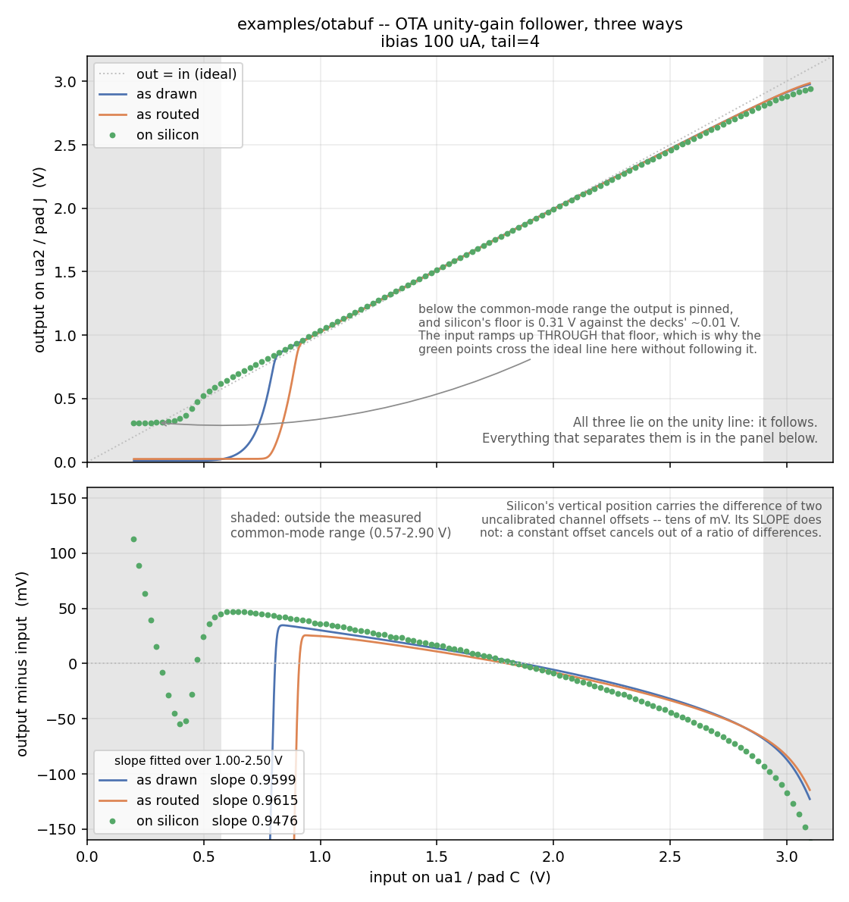

# Example: OTA unity-gain follower

*Shared background for all six examples -- as drawn vs as routed, the
testbench idiom, the probe model, the common gotchas -- is in
[`../README.md`](../README.md).*

The only example that uses `mosbius_ota` at all, and the only one that
closes a feedback loop through the switch matrix. Building it turned up
two router bugs, both since fixed; they are written up below because the
symptoms are worth recognising.

One device:

```
XA1 ua1 ua2 ua3 ua2 ibias VGND VAPWR mosbius_ota tail=4
```

Pin order is `inp inm outp outm`. So `inp` is the input on `ua1`, `outm`
is the output on `ua2`, and `inm` is tied to that same `ua2` -- the
feedback that makes this a follower. `outp` is brought out on `ua3`.

`mosbius_ota` is five transistors and a tail bank in one symbol -- the
one hardware block nothing else here exercises.

## Which output is the output

Feedback has to come from `outm`, not `outp`, and the difference is the
whole circuit.

Inside `mosbius_ota.sch` both PMOS load gates are tied to `outp`. That
makes `M1` diode-connected and `M2` its mirror, so `outp` is the
low-impedance mirror node and **`outm` is the high-impedance output with
the gain on it**. Tracing the polarity: raising `inm` increases `M4`'s
current and pulls `outm` down, so `outm` is inverting with respect to
`inm` -- negative feedback, a follower. Raising `inp` pushes `outm` up, so
the follower is non-inverting from `inp` to `outm`, which is what a
follower means.

Feeding `outp` back to `inm` instead would be positive feedback. It routes
just as cleanly and looks almost identical on the sheet; it is a latch.

`outp` is on `ua3` rather than left internal so the mirror node is
measurable -- it is the node that tells you whether the OTA is biased at
all. The bond pad costs it about 5 pF, but `outp` is the one node in the
circuit where that matters least, since its impedance is roughly `1/gm`.

`ua1` and `ua2` are forced choices: OTA inputs reach only bus rows 1-3,
and `ua1` and `ua2` are the pins bonded to `bus_A[1]` and `bus_A[3]`.

## Two bugs this example found, both now fixed

**`mosbius route` used to crash on any netlist with an OTA in it.**

```
ValueError: invalid literal for int() with base 10: 'tail'
```

`parse_netlist()` scanned every line of the file, with no notion of which
lines belong to the top-level design. Harmless for the FET symbols, whose
subcircuit bodies hold only raw sky130 devices -- but `mosbius_ota.sch`
builds its tail bank out of a `mosbius_nsink`, passing the OTA's own
parameter through as `ratio=tail`. The parser matched that line and died
on `int("tail")`; made tolerant, it would have gone on to count a current
sink the schematic never drew. It now reads only the block between
`**.subckt` and `**.ends`, and a file without those markers (this
project's hand-written test netlists) is still read whole.

Hand-written netlists never hit this, which is why an OTA had been
routable in the test suite and not from a real xschem netlist.

**The routed OTA used to have a floating mirror gate.** Bits 190 and 191
(`ctrl_otan_mode[0]` and `[1]`) tie the PMOS mirror gates to `outp` or to
`outm` -- upstream's `ota_n.sch` has a switch for each. `route.py` set
neither, so the gate node connected to nothing and the block was not an
amplifier, while `mosbius_ota.sch` (the as-drawn model of the same block)
hardwires those gates to `outp`. The two halves of this testbench were not
the same circuit. `route()` now closes `ctrl_otan_mode[0]` whenever a
design uses the OTA, matching the drawn model.

The tell, if you meet it again in a generated deck:

```
$ grep Rcfg19 build/otabuf_routed.spice
Rcfg190 ctrl_otan_mode[0] VDPWR 1e-12      <- closed (was VGND, i.e. open)
Rcfg191 ctrl_otan_mode[1] VGND  1e-12
```

## Routing

```
$ python3 -m mosbius.cli route build/otabuf.spice
OK -- no errors or warnings (1 info note hidden, use --verbose).

Device roles:
  XA1          -> ota           tail=4

Bus rows:
  ua1      bus_A[1]   package pin ua1 -- bond pad + analog mux
  ua2      bus_A[3] + bus_B[3]   package pin ua2 -- bond pad + analog mux
  ua3      bus_A[5]   package pin ua3 -- bond pad + analog mux

Bitstream: 404000000000000000000000000000000000000000850210
```

`ua2` showing as `bus_A[3] + bus_B[3]` is the OTA being the one device
with terminals on both bus sides at once -- `inm` on one side, `outm` on
the other, and the row shorted across to join them. `mosbius decode` on
that bitstream reads back `diode_connect_via_outp=True`.

## What is on the sheet

One `mosbius_ota`, the chip's nine pins, and one `mosbius_bias` wired to
the `ibias` pin. That last block is the chip's bias generator -- three
transistors behind one symbol -- and every design that uses a mirror, a
tail bank or the OTA needs exactly one; `mosbius route` says so if you
have none or two (`B1`). `examples/currentsource/README.md` explains what
it does.

Two of those three -- the NMOS copy and the PMOS diode that make
`ibias_p` -- do nothing here, since this design has no PMOS mirror or
PMOS tail. That is correct rather than wasteful: the chip has them
whatever you draw, and the routed netlist has them too.

## The testbench

`tb_otabuf.sch` is the standard two-instance sheet. `in` is shared (one
`Vin` for both); `out_drawn`/`out_routed` are `ua2`, and
`mirror_drawn`/`mirror_routed` are `ua3`. Both outputs carry the usual
`'cprobe'` capacitor at `.param cprobe=10p`, which here is not only a probe
model -- it sets the slew rate, and it is the load whose size decides
whether the loop stays stable.

Bias follows `examples/currentsource/`: `Ibias_drawn` and `Ibias_routed`
are separate sources at the same `'ibias_amps'` value, rather than one
source shared between the instances.

One `tran` does two experiments. `Vin` ramps slowly from 0.2V to 3.1V
between 1 us and 11 us -- slow enough that the follower tracks it, so the
output minus the input is the offset, and the ends of the ramp show where
the input common-mode range runs out. Then a 1.0V to 2.3V step at 13 us,
fast enough to slew, measured between 1.3V and 2.0V on the output. Slew
rate should come out as tail current over `cprobe`, so it should scale
directly with `tail=2/4/6/8` -- a prediction to check against silicon.

## What running it shows

Measured 2026-08-28 at `cprobe=10p (with rprobe=10meg)`, `ibias_amps=100u`, `tail=4`. Offsets
are output minus input, sampled on the ramp:

| input | as drawn | as routed |
|---|---|---|
| 1.00 V | +30.2 mV | +25.0 mV |
| 1.65 V | +8.6 mV | +5.9 mV |
| 2.50 V | -31.7 mV | -33.1 mV |

**Both branches follow, and they agree within about 5 mV.** That is the
expected answer for the same reason the diff amp's gain is: at DC nothing
flows into a capacitor, so the pad and switch-matrix resistance drop no
voltage. The offset that is there is not a mismatch offset -- this
schematic is perfectly symmetric and ngspice is noiseless -- it is the
finite-gain error of the loop, which is why it changes sign across the
range as the OTA's own gain varies.

**Input common-mode range**, read off the ramp: both track from about
0.85 V to about 2.9 V, and below that the follower gives up as the input
pair and tail bank run out of headroom. The routed branch loses it about
50 mV higher than the drawn one, which is the pad and matrix drop showing
up where headroom is scarce -- the one place in this measurement where
series resistance matters.

**Slew rate**, on the 1.0 V to 2.3 V step, measured between 1.3 V and
2.0 V:

```
slew_rate_drawn  = 42.9 V/us
slew_rate_routed = 15.4 V/us
```

As drawn, that is the textbook answer to within 7%: the tail bank at
`tail=4` delivers 4 x 100 uA, and 400 uA into 10 pF is 40 V/us. As routed
it is **2.78x slower**, which at the same tail current means the routed
output node carries about 26 pF rather than 10 pF -- roughly 16 pF of pad,
mux and matrix on top of the probe. Worth noting that 2.78 is almost
exactly the 2.77 ratio `examples/inverter/` measures for its rise time at
the same load; both are dominated by the same bond pad.

So the switch matrix costs this circuit **speed, not accuracy** -- the
same split as the diff amp, measured a different way.

**Runtime** is about 36 s in the IIC-OSIC-TOOLS container for the whole
15 us transient, both branches.

These numbers are unchanged by the bias-reference correction of
2026-08-28 (`examples/currentsource/README.md`), which is the answer you
want: the OTA's tail is a `ratio=tail` slave either way, and it was
already the only bias-referenced device on this sheet, so there was
nothing for its reference to split with. `tail=4` was 400 uA before and
is 400 uA now -- confirmed by the slew rate landing on the same
42.9 V/us.

## On silicon

**Measured 2026-08-29** on a ttsky25a part, TTDBv3 [3.2] demoboard, with an
Analog Discovery 3. This is the fourth example measured on real hardware
and the first that needed a bias current at all -- the other three
(inverter, SR latch, ring oscillator) are plain `mosbius_nmos`/
`mosbius_pmos` circuits with nothing referencing `ibias`.



**Getting a bias current took a detour**, because this demoboard has no
circuit to make one: the RP2350-controlled current source arrived on later
ETR boards, and on an older one `tt.analog_current_source` is `None`. So
`ibias` came from a bench supply through a 20 kOhm resistor into pad K --
see "Feeding it by hand, when the board can't" in
[`../README.md`](../README.md), which also records the first silicon
measurement of the bias reference itself. Confirming that pad was a
prerequisite rather than a nicety: `ua0` -> K had never been checked at a
bench. This run was at **100.1 uA**, interpolated from that clamp sweep
against a measured rail of 3.2879 V.

**The follower follows**, which was the point of measuring this one first:
a follower follows regardless of how much tail current it has, so the
result does not hinge on the number that is least well known here. Then the
detail, at `tail=4`:

| | as drawn | as routed | on silicon |
|---|---|---|---|
| closed-loop slope, 1.00-2.50 V | 0.9599 | 0.9615 | **0.9476** |
| offset at 1.00 V | +30.2 mV | +25.0 mV | +36.2 mV |
| offset at 1.65 V | +8.6 mV | +5.9 mV | +9.3 mV |
| offset at 2.50 V | -31.7 mV | -33.1 mV | -44.2 mV |
| input common-mode range | 0.85-2.90 V | 0.85-2.90 V | 0.57-2.90 V |
| output floor below that range | ~0.01 V | ~0.02 V | **0.31 V** |

**Read the slope, not the offsets.** Output minus input on a bench is the
difference of two uncalibrated scope channel offsets plus the real thing,
and on this instrument that difference is the same tens of millivolts as
the offsets being measured -- it is the 44 mV that moved
`examples/inverter/`'s threshold. A slope is a ratio of differences within
each channel, so a constant offset cancels out of it entirely. That is why
the figure's legend carries slopes and why the offset rows above are shape
rather than magnitude: the sign change near 1.65 V is real, the absolute
values wait on calibration.

So the number that means something: silicon's shortfall from unity is
**1.38x the routed model's**, which for a unity-gain follower says the real
OTA's open-loop gain is lower than modelled by about that factor. It is the
first quantitative disagreement any example here has found between the
routed model and silicon that is not explained by capacitance -- the
inverter's and the ring's both were.

**The upper common-mode edge lands on 2.90 V**, exactly as both decks
predict. The lower edge should not be compared: the 0.57 V here comes from
requiring the local slope to sit within 0.8-1.2 V/V, while the 0.85 V was
read off a simulated ramp by eye, so the two numbers are not the same
measurement.

**The output floor is an open divergence.** Below the common-mode range the
output is pinned, and it pins at 0.31 V on silicon against ~0.01 V in both
decks. At 300 mV that is much the largest disagreement in this measurement,
far outside anything channel offset could explain, and there is no
explanation for it here yet. It is annotated on the figure because it is
also the easiest feature to misread: the input ramps up *through* that
floor, so output minus input passes through zero on the way past and the
trace briefly looks like it is following when it is not. That trap cost a
wrong common-mode range on the first pass -- see `_tracking_band()` in
`tools/measure_otabuf_ad3.py`, which needs both a nearness test and a
slope test because either alone marks the dead region as tracking.

**Slew rate is not measured yet.** It needs a real edge, and
`ad3.wavegen()` makes levels: changing a DC output's offset is slewed over
milliseconds, which produces a clean, plausible and entirely wrong ramp.
That wants the triggered-capture idiom of
`tools/measure_srlatch_edge_ad3.py` as its own script, and it is the
measurement that would test the 2.78x capacitance claim above.

To reproduce:

```bash
python3 tools/measure_ibias_clamp_ad3.py --resistor 20000   # confirm pad K, set the rail
python3 tools/measure_otabuf_ad3.py                         # programs, sweeps, reports
python3 tools/plot_otabuf_comparison.py                     # redraws the figure
```

## On the bench

**Offset and input range** is done -- see "On silicon" above. One check
that went with it is still open: the feedback tie between `outm` and `inm`
happens on the bus row, on-chip, so the pad and mux resistance are outside
the loop, and the offset should not depend on which pin you observe
through. Testing that means routing the same circuit to a different output
pin and repeating the sweep. If the offset moves, the pad model needs
another look.

**Slew rate versus `tail`** is four bitstreams and a scope, and it is a
ratio measurement, so it survives the demoboard's uncalibrated bias
current.

**Stability** is the reason this circuit is worth building: the switch
matrix sits inside the feedback loop. Look for overshoot on the step,
then add load capacitance deliberately and find where it starts to ring.
If the routed simulation predicts that load, the matrix model has been
tested somewhere the open-loop examples cannot reach.
