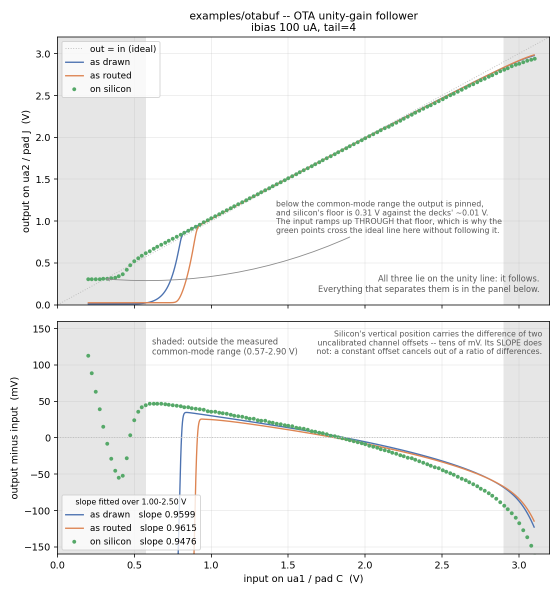

# OTA unity-gain follower

One device: the chip's operational transconductance amplifier, five
transistors and a tail bank in a single block, wired as a follower. The
input is on `ua1`, the output on `ua2`, and the inverting input is tied to
that same `ua2` -- the feedback that makes the output follow the input.
The mirror node is brought out on `ua3` so the bias can be seen. Feedback
has to come from the inverting output: the other output is the
low-impedance mirror node, and feeding that back builds a latch instead,
which routes just as cleanly and looks almost identical on the sheet.



*Fig. 1. Output against input, and output minus input, as drawn (ideal
wires), as routed (through the configured switch matrix, from `mosbius
simulate`), and measured on a ttsky25a chip with an Analog Discovery 3, at
`tail=4` and about 100 uA of bias.*

| | as drawn | as routed | on silicon |
|---|---|---|---|
| closed-loop slope, 1.00-2.50 V | 0.9599 | 0.9615 | 0.9476 |
| offset at 1.00 V | +30.2 mV | +25.0 mV | +36.2 mV |
| offset at 1.65 V | +8.6 mV | +5.9 mV | +9.3 mV |
| offset at 2.50 V | -31.7 mV | -33.1 mV | -44.2 mV |
| input common-mode range | 0.85-2.90 V | 0.85-2.90 V | 0.57-2.90 V |
| slew rate, 1.3-2.0 V rising | 42.9 V/us | 15.4 V/us | not published |

*Read the slope rather than the offsets: output minus input on a bench
carries the difference between two scope channel offsets, which on this
instrument is the same tens of millivolts as the offsets being measured. A
slope is a ratio of differences within each channel, so it survives that.*

## Try this

Trade current for speed. The follower's slew rate is set by how fast the
tail current can charge whatever hangs on the output -- the bond pad and
the probe included. `tools/ad3/measure_settling_ad3.py otabuf` steps the input
and times the output, and the bias current is whatever the supply and
series resistor put into pad K, so re-running it at a few supply settings
gives slew rate against bias. The table's slew row is what to compare
against; the script corrects for the Analog Discovery's 24 pF input first,
because that row assumes the sheet's 10 pF probe and slew goes as 1/C. The
silicon cell says "not published" rather than "not measured": this sweep
was run on 2026-08-29, but its result was never written down anywhere
outside a gitignored `build/` file, so there is no number here to stand
behind. Take it down until the output no longer
settles before the next step: that is this circuit's lower bias limit at
that load. The `tail` property (2, 4, 6 or 8) is the other half of the
same knob, and changing it is a new bitstream rather than a new supply
setting.

## Reproducing the numbers

```bash
sh tools/ci/check_example_sim.sh otabuf                        # as drawn and as routed, in the container
python3 tools/ad3/measure_ibias_clamp_ad3.py --resistor 20000   # set the bias rail
python3 tools/ad3/measure_otabuf_ad3.py                         # on silicon, on the host
python3 tools/plot_otabuf_comparison.py                     # the figure
```
