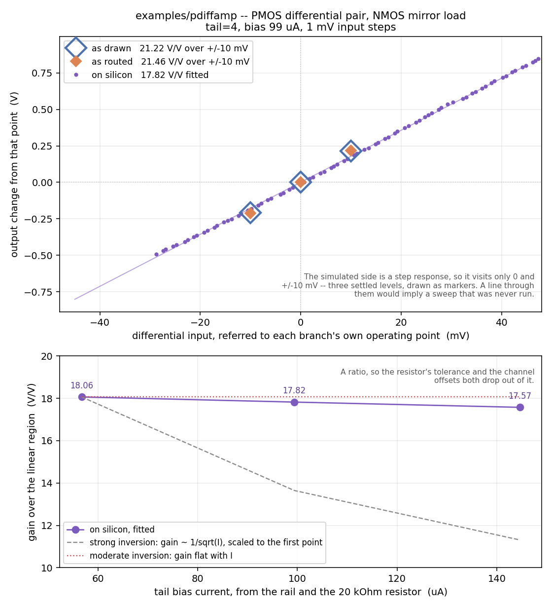

# PMOS differential amplifier

The polarity mirror of [`../diffamp/`](../diffamp/README.md): a PMOS
differential pair (`XM1`/`XM2`) biased by the PMOS tail bank (`XT1`),
loaded by a diode-connected NMOS current mirror (`XM3`/`XM4`). Draw the
NMOS version upside down, swap every device for its opposite type, and
this is what comes out. Its quiescent output sits one NMOS gate-source
drop above ground, where the NMOS version's sits one PMOS drop below the
supply, so it swings from the other end of the rail.



*Fig. 1. Output on `ua4` against the differential input, and gain against
tail current: as drawn (ideal wires), as routed (through the configured
switch matrix, from `mosbius simulate`), and measured on a ttsky25a chip
with an Analog Discovery 3. Simulated at the `tt` corner with the default
10x probe.*

| | as drawn | as routed | on silicon |
|---|---|---|---|
| small-signal gain | 21.22 V/V | 21.46 V/V | 17.82 V/V |
| output base | 1.112 V | 1.121 V | -- |

## Try this

Measure the input offset. Both simulated branches are symmetric by
construction, so neither can produce one at all: the sheet says the output
sits at its base voltage when the two inputs are equal, and the chip does
not. Sweep one input past the other and find where the output crosses its
own quiescent point. That number is mismatch between two transistors the
layout drew identically, and it is the one quantity here that only silicon
can tell you.

## Reproducing the numbers

```bash
sh tools/check_example_sim.sh pdiffamp                      # as drawn and as routed, in the container
python3 tools/measure_ibias_clamp_ad3.py --resistor 20000   # set the bias rail
python3 tools/measure_pdiffamp_ad3.py                       # on silicon, on the host
python3 tools/plot_pdiffamp_comparison.py                   # the figure
```
