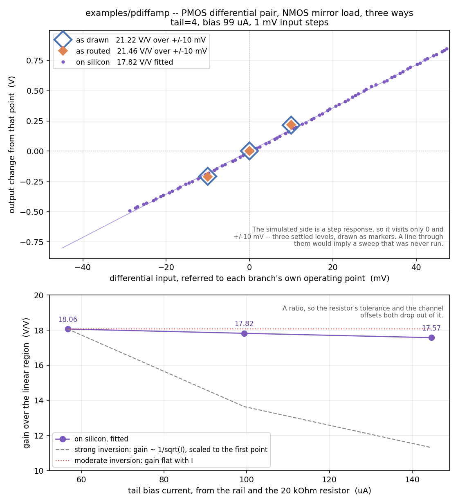

# Example: PMOS differential amplifier

*Shared background for all seven examples -- as drawn vs as routed, the
testbench idiom, capacitive loading, the common gotchas -- is in
[`../README.md`](../README.md).*

The polarity mirror of [`../diffamp/`](../diffamp/README.md): a **PMOS**
differential pair (`XM1`/`XM2`) biased by a PMOS tail current bank
(`XT1`), loaded by a diode-connected **NMOS** current mirror
(`XM3`/`XM4`). Draw that one upside down and swap every device for its
opposite type and you get this one.

It exists for two reasons. It is the only example that places a
`mosbius_ptail`, so it is the only one that exercises the PMOS tail bank
(`ctrl_dpp_tail`) and the `pdiffpair` halves as an actual pair rather than
as two independent FETs -- with it, every symbol in `xschem/mosbius_lib/`
appears in at least one worked example. And it is a second, independent
check on the same claim the diff amp makes: that the switch matrix costs a
settled gain nothing.

```
XM1 ua1  net2 net1 VAPWR mosbius_pmos  w=4
XM2 ua2  ua4  net1 VAPWR mosbius_pmos  w=4
XT1 net1 ibias_p VAPWR   mosbius_ptail tail=4
XM3 net2 net2 VGND VGND  mosbius_nmos  w=1
XM4 net2 ua4  VGND VGND  mosbius_nmos  w=1
```

`XM1`/`XM2` are the pair: gates on `ua1`/`ua2` (the two differential
inputs), sources tied together on `net1`. `XT1`'s one drawn pin, `d`, is
wired to that same `net1`, and that wiring *is* the declaration -- the
router reads it as "these two FETs sourced on `net1` are the pair", claims
`pdiffpair+`/`pdiffpair-` for them, and reaches `ctrl_dpp_tail` from
`XT1`'s own `tail=4`. `XT1`'s other two pins are not drawn: they are
hard-wired on silicon to `ibias_p` and `VAPWR`, supplied through
`mosbius_lib`'s `extra=` mechanism like every other body and bias pin.

`XM3` is diode-connected (gate tied to its own drain, on `net2`) and sets
the mirror's reference current; `XM4` mirrors it onto `ua4`, `XM2`'s
drain. `w=4` on the pair says what the hardware actually builds -- a
diff-pair half has no width bits, its geometry is fixed in silicon -- and
`ua1`/`ua2`/`ua4` are named for package pins so the circuit is reachable
at a bench. Both points are the same as the diff amp's, and
[its README](../diffamp/README.md) works through them.

## What the polarity swap changes

**The quiescent output moves to the other end of the rail.** An NMOS
mirror load holds the output one NMOS `Vgs` *above* `VGND` -- about
**1.12 V** here, against the diff amp's **2.0 V**, one PMOS `Vgs` below
`VAPWR`. Nothing is wrong when this one sits low; that is where a PMOS
pair with an NMOS load belongs. It does mean the output has less room
below it than above, which is why the testbench steps the input by
**±10 mV** rather than the diff amp's ±40 mV: at 21 V/V a −40 mV step
would take the output to within 250 mV of `VGND`, and the chord gain would
then be measuring the compression rather than the gain.

**The input common-mode range moves the other way too.** Swept on the
routed deck at `tt`, both inputs together, the amplifier holds its
operating point from **0.6 V up to about 2.0 V** and then loses it as the
tail runs out of headroom near `VAPWR`. An NMOS pair is the mirror of
that, needing room above `VGND` instead. The 1.5 V common mode the
testbench uses sits comfortably inside both.

## Routing

```
$ mosbius route build/pdiffamp.spice
OK -- no errors or warnings (1 info note hidden, use --verbose).

Device roles:
  XM1          -> pdiffpair+    w=4 (fixed)
  XM2          -> pdiffpair-    w=4 (fixed)
  XM3          -> nmos_a        w=1
  XM4          -> nmos_b        w=1
  XT1          -> ptail         tail=4

Bus rows:
  net2     bus_A[6] + bus_B[6]
  ua1      bus_A[1]   package pin ua1 -- bond pad + analog mux
  ua2      bus_A[3] + bus_B[3]   package pin ua2 -- bond pad + analog mux
  ua4      bus_B[2]   package pin ua4 -- bond pad + analog mux

Bitstream: 0c0000040000000000000120840000000820100800000030
```

Clean: no width dropped (both halves already ask for the fixed `w=4`, and
the two loads land on programmable FETs that can honour `w=1`), and no
`R2` warning, which is what says `XT1`'s `tail=4` reached the bitstream
rather than being ignored.

`net2` is the only net that needs both bus sides: the diode-connected load
is `nmos_a` (side A) and the mirror leg is `nmos_b` (side B), so the two
are joined on row 6 by `cfg_bus_short`. Row 6 is one of the two rows free
on both sides -- every other row is permanently bonded to a `ua[]` pin on
one side or the other.

## Decoding it back

```
$ mosbius decode 0c0000040000000000000120840000000820100800000030
Devices in use
  nmos_a      d=net3  g=net3  s=VGND  width=1  source_tied_to_VGND=True
  nmos_b      d=ua[4]  g=net3  s=VGND  width=1  source_tied_to_VGND=True
  pdiffpair+  g=ua[1]  d=net3  tail=4  shared_source_tied_to_VAPWR=False
  pdiffpair-  g=ua[2]  d=ua[4]  tail=4  shared_source_tied_to_VAPWR=False

Nets
  VGND     nmos_a.s  nmos_b.s
  ua[1]    ua[1] (bus_A[1])  pdiffpair+.g
  ua[2]    ua[2] (bus_A[3])  pdiffpair-.g
  net3     nmos_a.d  nmos_a.g  nmos_b.g  pdiffpair+.d
  ua[4]    ua[4] (bus_B[2])  nmos_b.d  pdiffpair-.d

ibias = 100.0 uA
```

`tail=4` comes straight back out of `ctrl_dpp_tail`, and
`shared_source_tied_to_VAPWR=False` says the pair's shared source is *not*
on the free rail tie, because a real tail bank is doing that job instead.
Delete `XT1` and re-route and it flips to `True` with `tail` gone -- and
the circuit stops being an amplifier, since a pair tied to its rail has no
tail current to steer.

The two loads come back as `nmos_a`/`nmos_b` with `source_tied_to_VGND=True`:
their sources reach `VGND` through each FET's own `ctrl_*_source` tie,
which costs no bus row at all.

## Reproducing this

From the repo root, so xschem picks up `xschemrc` (CLAUDE.md -- get this
wrong and every device comes back `IS MISSING !!!!`):

```bash
docker run --rm -v "$PWD:/work" -w /work hpretl/iic-osic-tools:latest \
  --skip bash -lc 'xschem -n -q examples/pdiffamp/pdiffamp.sch'
mosbius route build/pdiffamp.spice
```

`sh tools/check_pdiffamp_sim.sh`, inside that container, does the whole
loop -- netlist, route, build the routed subcircuit, netlist the
testbench, run ngspice, and check the numbers below.

## Simulation

Measured 2026-08-29 from `tb_pdiffamp.sch`, at `rprobe=10meg cprobe=10p`,
with `ua2` held at 1.5 V and `ua1` stepped ±10 mV around it:

| | `ua4` base | after `+10mV` | after `-10mV` | gain + | gain - |
|---|---|---|---|---|---|
| as drawn | 1.112 V | 1.328 V | 0.904 V | 21.60 V/V | 20.84 V/V |
| as routed | 1.121 V | 1.339 V | 0.910 V | 21.82 V/V | 21.11 V/V |

**The two branches agree to about 1%, which is the expected answer**, and
is the same result the diff amp reports for its own polarity. At DC no
current flows into a capacitor, so the pad's and the switch matrix's
series resistance drop no voltage; everything the routed model adds is
resistance and capacitance, and neither changes a settled gain. What the
matrix costs this circuit is bandwidth.

### Step response

Fitted from the same run's `build/pdiffamp_tb_out_*.txt`:

| | time constant | 10%-90% | implied output impedance |
|---|---|---|---|
| as drawn | 109 ns | 235 ns | ~11 kOhm at 10 pF |
| as routed | 254 ns | 535 ns | ~17 kOhm at ~15 pF |

The routed branch is 2.3x slower for two compounding reasons: the bond pad
adds about 5 pF on top of `cprobe`, and the switch matrix adds series
resistance. Five routed time constants is 1.3 us, which is why
`tb_pdiffamp.sch` holds each input level for 2.5 us and samples 5 ns before
the end of the plateau:

```
Vinp  PWL(0 1.5  999n 1.5  1000n 1.51  3499n 1.51  3500n 1.49  5999n 1.49  6000n 1.5)
tran 5n 6.5u
```

### The model-binning bug this example found

The first version of this page would have said the two branches disagree
by **55%** -- 14.2 V/V as drawn against 21.5 V/V as routed -- and the
as-drawn output sat 216 mV low, at 0.905 V. That was not the circuit. It
was the ideal device library passing sky130 a width it could not bin.

`mosbius_nmos.sch` sized its FET as `W="10*w"`, where `w` is the symbol's
own user-facing width parameter. `sky130_fd_pr__nfet_g5v0d10v5` is a
*binned* model subcircuit whose own parameter is also called `w`, so the
expression was re-evaluated in the callee's scope, where `w` means
something else -- and the wrong bin was selected. Same final geometry
(ngspice reports W = 10 um and L = 0.5 um either way), different model
card, different threshold: **0.535 V against 0.822 V**, worth 200 mV of
`Vgs` at the same 187 uA.

The fix keeps every user-facing name and changes no schematic anyone
draws: the device schematics now compute the size into a differently-named
parameter first, and hand the model *that*.

```spice
.param wdev='10*w' nfdev='2*w'
XM1 d g s b sky130_fd_pr__nfet_g5v0d10v5 L=0.5 W=wdev nf=nfdev ...
```

Isolated in a three-device deck: `W="10*w"` with `w=1` gives 0.904 V at
187 uA, while both `W=10` written literally and the `.param` form give
1.110 V -- identical to the last digit. **This affected every as-drawn
number in the repo that involves `mosbius_nmos` or `mosbius_pmos`**, so
the inverter, ring oscillator, SR latch and diff amp pages need
re-measuring against the corrected library; `TODO.md` tracks that. The
mirror, tail and OTA symbols size themselves off `ratio` and `tail`, which
collide with nothing, and were never affected.

The general trap, which is not specific to this project: **an expression
passed into a subcircuit must not name a parameter the callee also
defines.** It fails silently, produces a plausible circuit, and only shows
up as a number that is wrong by a believable amount.

## On silicon

**Measured 2026-08-29** on a ttsky25a part with an Analog Discovery 3 --
`python3 tools/measure_pdiffamp_ad3.py`, after
`tools/measure_ibias_clamp_ad3.py --resistor 20000` set the bias rail.
Sixth example on real hardware, and the second PMOS-tail circuit of any
kind.



### Gain

| | as drawn | as routed | on silicon |
|---|---|---|---|
| gain | 21.22 V/V | 21.46 V/V | **17.82 V/V** |

Fitted over the linear region (0.5-1.8 V of output) at 99.4 uA, from an
81-point sweep in 1 mV steps. Silicon is **16% below** the as-drawn
figure, and the two simulated branches agree with each other to 1%.

**That shortfall is the third of its kind on this part, in the same
direction.** `examples/diffamp/` came out 18% below its as-drawn gain and
`examples/otabuf/`'s closed-loop error was 1.38x the routed model's. This
chip is an `ss` part while every published number here is `tt`
(CLAUDE.md), and gain is exactly the sort of quantity a corner moves.
Three independent circuits agreeing on the sign and roughly on the size is
what turns that from a plausible excuse into an explanation worth testing
with `tools/sweep_corners.sh`.

### Gain against tail current

| tail current | fitted gain |
|---|---|
| 56.7 uA | 18.06 V/V |
| 99.4 uA | 17.82 V/V |
| 144.6 uA | 17.57 V/V |

**Gain barely moves: 1.028x across 2.55x of current.** Strong-inversion
square law predicts 1.60x -- gain is `gm x Rout`, `gm` goes as sqrt(I) and
`Rout` as 1/I, so gain goes as 1/sqrt(I). Flat with current is what
*moderate* inversion gives, where `gm` is proportional to I and the two
dependencies cancel.

`examples/diffamp/` measured 1.059x across 2.6x and drew the same
conclusion from an NMOS pair. This is the PMOS pair saying it too, which
is worth more than a repeat: the two use different devices, different tail
banks and different mirror polarities, so the agreement is about where
these devices sit in inversion rather than about one bank's sizing. Still
one part measured once.

### Input offset

The pair's input offset is **+18 mV**: the fitted transfer curve crosses
1.1 V of output at `ua1` = 1.5179 V, against the 1.500 V the other input
is held at. The three bias points put the centre at +39.6, +29.8 and
+29.9 mV by the coarse sweep's own cruder rule, which is the same quantity
measured less precisely.

This is the one number the simulated sheet cannot produce at all. As drawn
and as routed are both perfectly symmetric by construction and ngspice is
noiseless, so their offset is exactly zero; silicon's is device mismatch.

It also explains the first reading the script takes. With both inputs at
1.4994 V -- 18 mV to one side of centre -- pad G sat at **0.7696 V**, not
at the 1.112 V the sheet predicts for a balanced pair. 18 mV of input
offset times ~18 V/V is 320 mV of output, and 1.1 - 0.32 = 0.78 V. The
operating point is where it should be; the inputs were not.

### Reproducing it

```bash
python3 tools/measure_ibias_clamp_ad3.py --resistor 20000   # pad K, set the rail
python3 tools/measure_pdiffamp_ad3.py                       # programs, sweeps, reports
python3 tools/plot_pdiffamp_comparison.py                   # redraws the figure
```

Wiring is in the table the script prints: V+ through 20 kOhm to **K**, W1
and scope 1+ on **C**, W2 on **J**, scope 2+ on **G**.

### Not measured

Step response and bandwidth. `tools/measure_settling_ad3.py` covers the
first for the NMOS diff amp and would extend here.

## Load capacitors in `tb_pdiffamp.sch`

The usual pair, both `'cprobe'` with a matching `'rprobe'`, `.param
cprobe=10p rprobe=10meg` -- see [`../README.md`](../README.md). As with
the diff amp, the load does not affect the gain here, only how long you
wait for it.

## Testbench net names

`tb_pdiffamp.sch` follows the shared convention -- no suffix for a net
shared between the two instances, `_drawn`/`_routed` for one that differs
per instance. See [`../README.md`](../README.md).
