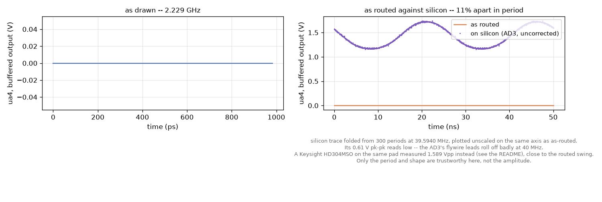

# Ring oscillator

Three inverting stages wired in a loop, with a fourth inverter buffering
the loop out to `ua4`. Eight transistors, which is every usable single FET
on the chip. An odd number of inversions round a closed loop has no stable
state, so the loop free-runs. The buffer is there because a probe on a
loop node is inside the feedback path and changes the oscillator instead
of measuring it.



*Fig. 1. Two periods of the buffered output on `ua4`: as drawn (ideal
wires), and as routed (through the configured switch matrix, from `mosbius
simulate`) against a ttsky25a chip measured with an Analog Discovery 3,
folded from 300 periods, on the same voltage axis as the routed trace. The
silicon trace reads low due to limited bandwidth of the AD3.*

| | as drawn | as routed | on silicon |
|---|---|---|---|
| frequency | 2.229 GHz | 43.92 MHz | 39.59 MHz |
| against silicon | x56 too fast | +10.9% | -- |
| amplitude (Vpp) | 0.198 V | 1.72 V | 1.750 V |

Keysight HD304MSO used for amplitude measurement. Numbers above are for the
buffered output on `ua4` (moved from `ua3` 2026-09-08 so this schematic also
routes on Andrew Kang's part -- see CLAUDE.md); the loop itself is unchanged.

## On Andrew Kang's part

| | as drawn | as routed | on silicon |
|---|---|---|---|
| frequency | 2.227 GHz | 51.69 MHz | 44.61 MHz |
| against silicon | x50 too fast | +15.9% | -- |
| amplitude (Vpp) | -- | -- | 1.159 V |

## Try this

Find the process corner this chip came from. `sh tools/sweep_corners.sh`
re-runs the routed deck at `tt`, `fs`, `sf`, `ff` and `ss` by rewriting
the `.lib` line in the netlist, and `python3 tools/compare_corners.py`
ranks the results against the bench.

A ring's frequency alone will not settle it, which is the interesting
part: slowing the PMOS while speeding the NMOS roughly cancels around a
loop, so the mixed corners sit close together. Run the same sweep on
[`../inverter/`](../inverter/README.md), whose trip point is a pure
NMOS-against-PMOS strength ratio, and see which corner the two agree on.

## Reproducing the numbers

The first line runs in the IIC-OSIC-TOOLS container; the rest run on
the host. [`../README.md`](../README.md#running-each-examples-commands)
has the docker invocation.

```bash
sh tools/sim/check_example_sim.sh ring   # as drawn and as routed, in the container
python3 tools/ad3/measure_ring_ad3.py    # frequency and a waveform, on the host
python3 tools/plot_ring_comparison.py    # the figure
python3 tools/measure_ring_keysight.py <scope VISA resource>   # trustworthy amplitude
```
