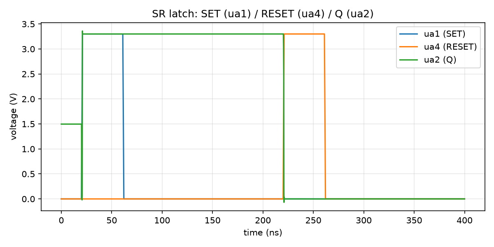

# Example: SR latch

Six transistors: two cross-coupled inverters holding state (`m1`-`m4`) plus
two independent pull-down transistors (`mset`, `mreset`) that force the
state. This reproduces [the second circuit tnt built](https://www.tinytapeout.com/news/mini-mosbius/)
bringing up real mini-MOSbius silicon -- "6 of the 8 mosfets to build 2
inverters to store the data and 2 pull down switches for set and reset" is
exactly this topology, independently arrived at here from the router's own
transistor-budget constraints rather than copied from the post.

```
m1     qb  ua2  VGND   VGND   mosbius_nmos w=2
m2     ua2 qb   VGND   VGND   mosbius_nmos w=2
m3     qb  ua2  VAPWR  VAPWR  mosbius_pmos w=2
m4     ua2 qb   VAPWR  VAPWR  mosbius_pmos w=2
mset   ua1 qb   VGND   VGND   mosbius_nmos w=2
mreset ua4 ua2  VGND   VGND   mosbius_nmos w=2
```

`m1`/`m3` form one inverter (input `qb`, output `ua2`); `m2`/`m4` form the
other (input `ua2`, output `qb`) -- cross-coupled, so each holds the other's
output through positive feedback once nothing is actively driving it.
`mset` pulls `qb` low (forcing `ua2`/Q high); `mreset` pulls `ua2` low
directly (forcing Q low). Q is read back on `ua2`.

## A routing constraint this example ran into

The first version of this circuit used `ua3` for the reset input, which
**does not route** -- `route()` doesn't reject it cleanly either; it
crashes with an internal `KeyError` rather than a proper `RouteError`,
which is a real gap worth knowing about rather than a mystery to debug
blind. The reason: only two of this chip's independent-NMOS slots exist,
so with four NMOS all sharing `VGND` as their source (`m1`, `m2`, `mset`,
`mreset`), two of them necessarily get assigned the diff-pair-half "pair"
role standing in alone -- and CLAUDE.md's traps list is explicit that
**diff-pair inputs only reach bus rows 1-3**, unlike every other terminal,
which reaches all six. `ua3` physically bonds to `bus_A[5]` -- outside that
range -- so whichever of `mset`/`mreset` lands on the pair role can never
place its gate. `ua1` (row 1) and `ua4` (row 2) both work, which is why
this example uses `ua4` for reset instead.

If you hit this in your own design: an unexplained crash from `route()`
(rather than a `RouteError` with an explanation) on a circuit using an
external pin as a gate for a device that might get a diff-pair role is
almost certainly this. Move the net to `ua1`, `ua2`, or `ua4`.

## Routing

```
$ python3 -m mosbius.cli route build/srlatch.spice
WARNING -- xpt_nfeta_g has no DC path to a rail or a package pin
  ... (5 of these total, one per crosspoint touching the internal qb node)

Device roles:
  m1           -> nfeta
  m2           -> nfetb
  m3           -> pfeta
  m4           -> pfetb
  mset         -> ndiffpair+
  mreset       -> ndiffpair-

Bitstream: 2e008002e010020420000000010809000810800400000030
```

No errors, but five W2 warnings on crosspoints touching the internal `qb`
node ("no DC path to a rail or a package pin") -- expected, not a bug:
that's exactly what a bistable node looks like to a checker that only sees
closed switches, not transistor conduction state. `qb`'s voltage is held
by feedback, which is the entire point of a latch -- see the Simulation
section below for what that looks like in practice (including the
power-up state it implies).

## Simulation



The plot shows `ua1` (SET) and `ua4` (RESET) pulses against `ua2` (Q). What
it actually demonstrates: at power-up, with neither SET nor RESET driven,
the latch starts at an undefined operating point (`Q` sits around 1.5V --
neither rail -- since with both pull-downs off the cross-coupled pair has
no external push toward either state) and resolves to `Q=HIGH` within
about 20ns, before the SET pulse even arrives at t~61ns. That's a real,
if slightly unlucky, property of this exact circuit, not a simulation
bug: an SR latch's power-up state is inherently arbitrary, decided by
whichever tiny asymmetry the solver's numerics happen to amplify first --
this run happened to resolve high, so SET's pulse (t~61ns) has no visible
effect (`Q` was already where SET would have driven it). RESET's pulse
(t~221-261ns) is the one that's unambiguous: `Q` drops to 0V exactly when
RESET goes high, and -- this is the actual point of a *latch* rather than
a combinational gate -- **stays at 0V after RESET releases**, held there
by the cross-coupled feedback rather than by anything actively driving it.

Unlike the inverter, there's no single published trise number to compare
against for this circuit -- the blog post describes the same topology and
behavior (SET/RESET pulses flipping the stored state) rather than a timing
measurement. The comparison here is topological and behavioral: the
circuit this project independently arrived at, via the router's own
transistor-budget constraints, is the same 6-transistor cross-coupled
topology tnt built and described, and it demonstrates the same core
property (a pulse forces a state that then persists after the pulse ends).
