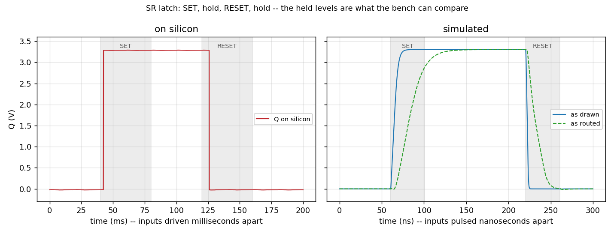

# SR latch

Six transistors: two cross-coupled inverters that hold a bit, plus two
pull-down transistors that force it. `XM1`-`XM4` are the pair of
inverters, each holding the other's output through positive feedback once
nothing is driving them. `XM5` pulls the internal node low, forcing Q
high; `XM6` pulls Q low directly. The external connections are `ua1` =
SET, `ua2` = RESET and `ua3` = Q; Qb stays inside the chip, since there is
no fifth pin for it.



*Fig. 1. SET, hold, RESET, hold, on silicon (left) and simulated (right).
The shaded bands are the intervals when SET and RESET are actually driven;
the flat stretches to the right of each band are the stored state, which
is what makes this a latch rather than a gate. The two panels cannot share
a time axis -- the bench drives the inputs milliseconds apart and the
simulation nanoseconds apart -- so they share the voltage axis only.*

| | as drawn | as routed | on silicon |
|---|---|---|---|
| Q holding a 1 | 3.2999 V | 3.2998 V | 3.3079 V |
| Q holding a 0 | 0.0000 V | -0.0003 V | 0.0000 V (reference) |
| reset time | 8.28 ns | 19.89 ns | 24.46 ns |

*The reset time is RESET crossing mid-rail to Q crossing it, with all
three columns driven by the same bench edge; the committed testbench uses
a faster edge of its own and reads shorter.*

## Try this

Watch the latch power up. With both inputs idle the circuit has three DC
solutions -- Q high, Q low, and a balanced one with both inverters sitting
at their own switching threshold -- and only the first two are stable.
ngspice is noiseless and the as-drawn instance is perfectly symmetric, so
its operating-point solver lands on the balanced solution and stays there
until numerical error breaks the tie. Delete the `.ic` line in
`tb_srlatch.sch` and see how long that takes, and whether it resolves
before SET arrives. The as-routed instance never has the problem, because
its two halves sit on different bus rows and are not symmetric to begin
with.

## Reproducing the numbers

```bash
sh tools/check_srlatch_sim.sh          # as drawn and as routed, in the container
python3 tools/measure_srlatch_ad3.py   # levels on silicon, on the host
python3 tools/measure_srlatch_edge_ad3.py   # the reset edge, on the host
python3 tools/plot_srlatch_comparison.py    # the figure
```
